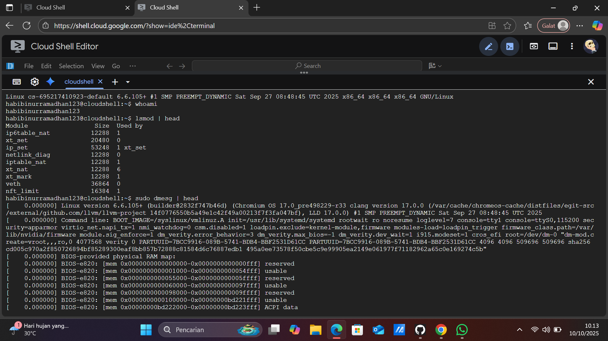

# Laporan Praktikum Minggu [1]
Topik: "Laporan Arsitektur OS"

---

## Identitas
- **Nama**  : M. Habibi Nur Ramadhan
- **NIM**   : 250202949
- **Kelas** : 1IKRB

--- 

## Tujuan
> Mahasiswa mampu menjelaskan fungsi utama sistem operasi dan peran kernel serta system call. 

---

## Dasar Teori
Jadi sistem operasi atau (OS) adalah sebuah konsep awal yang perlu di pelajari untuk mahasiswa ilmu komputer di mana sistem operasi adalah sebuah perangkat lunak yang menghubungkan antara user dan perangkat keras, mengelola seluruh sumber daya komputer. Ada beberapa point yang akan di pelajari untuk mengenal konsep awal pada komputer:
* Model sebuah arsitektur OS seperti **monolithic kernel, microkernel , hybird kernel dan layered approach**
* Mekanisme dari **system call**
* Mode eksekusi **kernel mode** dan **user mode**
  

---

## Langkah Praktikum
1. **Setup Environment**
   - Pastikan Linux (Ubuntu/WSL) sudah terinstal.
   - Pastikan Git sudah dikonfigurasi dengan benar:
     ```bash
     git config --global user.name "Nama Anda"
     git config --global user.email "email@contoh.com"
     ```

2. **Diskusi Konsep**
   - Baca materi pengantar tentang komponen OS.
   - Identifikasi komponen yang ada pada Linux/Windows/Android.

3. **Eksperimen Dasar**
   Jalankan perintah berikut di terminal:
   ```bash
   uname -a
   whoami
   lsmod | head
   dmesg | head
   ```
   Catat dan analisis modul kernel yang tampil.

4. **Membuat Diagram Arsitektur**
   - Buat diagram hubungan antara *User → System Call → Kernel → Hardware.*
   - Gunakan **draw.io** atau **Mermaid**.
   - Simpan hasilnya di:
     ```
     praktikum/week1-intro-arsitektur-os/screenshots/diagram-os.png
     ```

5. **Penulisan Laporan**
   - Tuliskan hasil pengamatan, analisis, dan kesimpulan ke dalam `laporan.md`.
   - Tambahkan screenshot hasil terminal ke folder `screenshots/`.

6. **Commit & Push**
   ```bash
   git add .
   git commit -m "Minggu 1 - Arsitektur Sistem Operasi dan Kernel"
   git push origin main
   ```

---

## Kode / Perintah
Tuliskan potongan kode atau perintah utama:
```bash
git config --global.user "nama"
```
```bash
git config --global.email "email@"
```
```bash
git add .
```
```bash
git commit -m "Title"
```
```bash
git push -u origin main
```
```bash
uname -a
```
```bash
whoami
```
```bash
lsmod | head
```
```bash
dmesg | head
```
---

## Hasil Eksekusi
Sertakan screenshot hasil percobaan atau diagram:


---

## Analisis
- Jelaskan makna hasil percobaan.  
- Hubungkan hasil dengan teori (fungsi kernel, system call, arsitektur OS).  
- Apa perbedaan hasil di lingkungan OS berbeda (Linux vs Windows)?  

### 1.Analisis kode perintah
pada git :
- **`git config --global user.name "nama"`** Untuk mengatur informasi identitas pengguna git secara global.
- **`git config --global user.email "email"`** Mencantukan email pada setiap commit.
- **`git add .`** Menambahkan perubahan file ke staging area sebelum di commit ke repository.
- **`git commit -m `** Memberikan commit (pesan yang akan di kirim) ke repository.
- **`git push -u origin main`** menambahkan file ke repository.

pada linux:
- **`uname -a`** Mengidentifikasi versi kernel linux yang digunakan, Linux cs-695217410923-default 6.6.105+.
- **`whoami`** Menampilkan nama pengguna yaitu : habibinurramadhan123
- **`lsmod | head`**  Menampilkan daftar modul kernel yang sedang di muat di sistem linux.
- **`dmesg | head`**  Digunakan untuk menampilkan pesan kernel biasanya berisi informasi  saat booting, deteksi perangkat keras, error driver atau modul kernel, dan informasi perangkat baru yang dicolokkan.
### 2.Analisis Arsitektur OS
- Bisa kita lihat bahwa kernel memiliki hak akses pada usermode dan kernel mode , hak akses pada mode kernel meliputi hak akses yang tidak terbatas , maka diperlukan dua mode untuk masalah keamanan , stabilitas , dan kontrol sistem.
- Disini system call berfungsi memjembatani antara pengguna terhadap akses ke aplikasi.
- Jadi arsitektur OS ini bekerja sama dalam mengelola sumber daya komputer.
### 3.Analisis lingkungan os berbeda antara Linux dan windows
**Linux** ini sangat fleksiblel dan dapat di modifikasi sesuai kebutuhan, mendukung scripting pada (bash,shell) untuk otomatisasi, linux lebih cocok untuk pengembangan dan pengguna teknis.
sedangkan **windows** Fokus kepada kemudahan pengguna, cocok untuk pengguna umum, bisnis dan gaming. lebih mudah di operasikan tanpa banyak perintah teknis. 

---

## Kesimpulan
* Bisa disimpulkan bahwa arsitektur OS merupakan kerangka dasar dalam komputer untuk mengatur hubungan antara hardware, kernel, dan system call dan aplikasi. Arsitektur ini bertujuan untuk menjalankan fungsi utamanya yaiu mengelola sumber daya komputer (CPU, Memori, Perangkat I/O dan file).
* Perintah Linux berfungsi untuk memberi instruksi langsung kepada sistem operasi agar melakukan tugas tertentu. Melalui command line (terminal), contoh perintah : `uname -a` `whoami` `lsmod | head` `dmesg | head`.

---

## Quiz
1. Sebutkan tiga fungsi utama sistem operasi.
   **Jawaban:**
     Fungsi sistem operasi di antaranya yaitu sebagai manajemen perangakat keras, manajemen file & penyimpanan , serta menghubungkan user dengan perangkat.
2. Jelaskan perbedaan antara kernel mode dan user mode.
   **Jawaban:**
     Usermode atau *mode pengguna*  dan Kernel mode atau *mode kernel*  merupakan tingkatan dalam mengakses sistem inti (kernel) dari aplikasi yang dijalankan pengguna. Pada **usermode** hak akses terbatas ke sumber daya sistem , seperti memori dan perangkat keras. Sedangkan **Kernel mode** memberikan hak akses penuh ke sumberdaya sistem. 
3. Sebutkan contoh OS dengan arsitektur monolithic dan microkernel.
   **Jawaban:**
    * Contoh arsitektur os dari monolithic: Linux, MS-DOS , BSD , Solaris , dan windows
    * contoh arsitektur os Microkernel: QNX, MINIX, GNU Hurd, L4 microkernel family, dan zicron
   
   

---

## Refleksi Diri
Tuliskan secara singkat:
- Apa bagian yang paling menantang minggu ini? **semua bagian dari minggu ini menantang karena baru mempelajari basic pada komputer, mulai dari memperkenalkan bagian-bagian komputer sampai dengan pengoperasian aplikasi seperti vscode, git bash, github , draw.io dan lain-lain.**
- Bagaimana cara Anda mengatasinya? **Saya mempelajari ini secara otodidak dan dengan berdiskusi dengan teman.**

---

**Credit:**  
_Template laporan praktikum Sistem Operasi (SO-202501) – Universitas Putra Bangsa_
