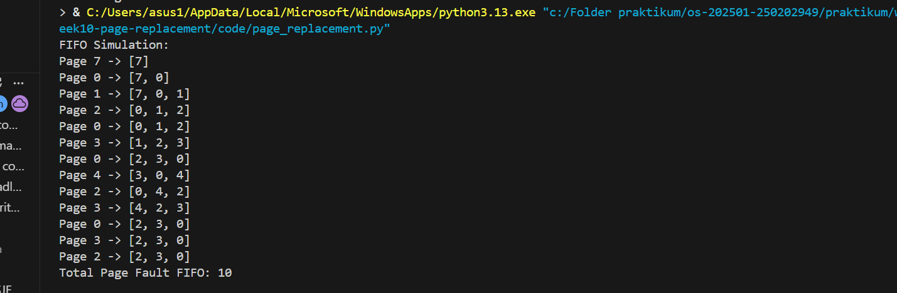
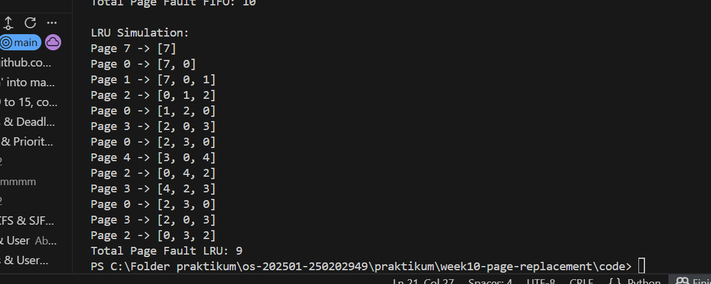

# Laporan Praktikum Minggu 10
Topik: Manajemen Memori – Page Replacement (FIFO & LRU)
---

## Identitas
- **Nama**  : M. Habibi Nur Ramadhan 
- **NIM**   : 250202949 
- **Kelas** : 1IKRB

---

## Tujuan
Pada praktikum minggu ini, mahasiswa akan mempelajari manajemen memori virtual, khususnya mekanisme page replacement.
Fokus utama praktikum adalah memahami bagaimana sistem operasi mengganti halaman (page) di memori utama ketika terjadi page fault, serta membandingkan performa algoritma FIFO (First-In First-Out) dan LRU (Least Recently Used).

Mahasiswa akan mengimplementasikan program simulasi page replacement, menjalankan dataset uji, dan menyajikan hasil dalam bentuk tabel atau grafik.

Setelah menyelesaikan tugas ini, mahasiswa mampu:
1. Mengimplementasikan algoritma page replacement FIFO dalam program.
2. Mengimplementasikan algoritma page replacement LRU dalam program.
3. Menjalankan simulasi page replacement dengan dataset tertentu.
4. Membandingkan performa FIFO dan LRU berdasarkan jumlah page fault.
5. Menyajikan hasil simulasi dalam laporan yang sistematis.

---

## Dasar Teori
1. **Algoritma** adalah urutan langkah-langkah logis dan sistematis yang digunakan untuk menyelesaikan suatu masalah atau mencapai tujuan tertentu. Algoritma page replacement ini merupakan aturan atau metode yang digunakan sistem operasi untuk menentukan halaman (page) mana yang harus diganti (dikeluarkan) dari memori ketika memori sudah penuh dan halaman baru harus dimasukkan. 

2. First In First Out (FIFO)
   Untuk algoritma FIFO, kita cukup menghapus halaman dalam frame, secara berurutan. Sesuai dengan namanya FIFO = yang masuk duluan, kluar duluan. Page yang paling lama berada di memori akan diganti lebih dulu, tanpa melihat apakah page itu sering dipakai atau tidak.

3. Algoritma Least Recently Used (LRU)
LRU adalah algoritma page replacement yang mengganti page berdasarkan penggunaan terakhir, bukan urutan masuk. Telihat cukup mirip dengan FIFO untuk cara kerjanya. Ketika sebuah halaman dirujuk dan berada dalam frame, halaman tersebut dihapus dari posisinya saat ini, kemudian pada dasarnya dimasukkan kembali ke dalam antrian di akhir frame. Jika halaman baru dirujuk dan tidak ada dalam frame, kita cukup menghapus halaman tersebut di akhir frame karena itu adalah halaman yang paling jarang digunakan.

- Silberschatz, A., Galvin, P. B., & Gagne, G.
Operating System Concepts, Wiley
- https://os-project-page-replacement.vercel.app/
- Andrew S. Tanenbaum
Modern Operating Systems, Pearson
---


## Langkah Praktikum dan Ketentuan Teknis

Bahasa pemrograman bebas (Python / C / Java / lainnya).
Program berbasis terminal (tidak wajib GUI).
Fokus penilaian pada logika algoritma dan keakuratan hasil simulasi.
Struktur folder (sesuaikan dengan template repo):
```
praktikum/week10-page-replacement/
├─ code/
│  ├─ page_replacement.*
│  └─ reference_string.txt
├─ screenshots/
│  └─ hasil_simulasi.png
└─ laporan.md
```

1. **Menyiapkan Dataset**

   Gunakan *reference string* berikut sebagai contoh:
   ```
   7, 0, 1, 2, 0, 3, 0, 4, 2, 3, 0, 3, 2
   ```
   Jumlah frame memori: **3 frame**.

2. **Implementasi FIFO**

   - Simulasikan penggantian halaman menggunakan algoritma FIFO.
   - Catat setiap *page hit* dan *page fault*.
   - Hitung total *page fault*.

3. **Implementasi LRU**

   - Simulasikan penggantian halaman menggunakan algoritma LRU.
   - Catat setiap *page hit* dan *page fault*.
   - Hitung total *page fault*.

4. **Eksekusi & Validasi**

   - Jalankan program untuk FIFO dan LRU.
   - Pastikan hasil simulasi logis dan konsisten.
   - Simpan screenshot hasil eksekusi.

5. **Analisis Perbandingan**

   Buat tabel perbandingan seperti berikut:

   | Algoritma | Jumlah Page Fault | Keterangan |
   |:--|:--:|:--|
   | FIFO | ... | ... |
   | LRU | ... | ... |


   - Jelaskan mengapa jumlah *page fault* bisa berbeda.
   - Analisis algoritma mana yang lebih efisien dan alasannya.

6. **Commit & Push**

   ```bash
   git add .
   git commit -m "Minggu 10 - Page Replacement FIFO & LRU"
   git push origin main
   ```


---

## Kode / Perintah
Tuliskan potongan kode atau perintah utama:
```bash
def read_reference_string(filename):
    with open(filename, "r") as file:
        content = file.read()
        pages = list(map(int, content.replace(",", " ").split()))
    return pages


def fifo(pages, frames):
    memory = []
    faults = 0

    print("FIFO Simulation:")
    for page in pages:
        if page not in memory:
            faults += 1
            if len(memory) < frames:
                memory.append(page)
            else:
                memory.pop(0)
                memory.append(page)
        print(f"Page {page} -> {memory}")

    print("Total Page Fault FIFO:", faults)


def lru(pages, frames):
    memory = []
    faults = 0

    print("\nLRU Simulation:")
    for page in pages:
        if page not in memory:
            faults += 1
            if len(memory) < frames:
                memory.append(page)
            else:
                memory.pop(0)
                memory.append(page)
        else:
            memory.remove(page)
            memory.append(page)
        print(f"Page {page} -> {memory}")

    print("Total Page Fault LRU:", faults)


# ================= MAIN =================#
frames = 3  
pages = read_reference_string("reference_string.txt")

fifo(pages, frames)
lru(pages, frames)

```

---

## Hasil Eksekusi
Hasil perhitungan:


---

## Analisis

   | Algoritma | Jumlah Page Fault | Keterangan |
   |:--|:--:|:--|
   | FIFO | 10 | Lebih banyak page |
   | LRU | 9 | Lebih efisien di bandingkan FIFO |


   - FIFO memiliki lebih banyak page di bandingkan dengan LRU karena dalam algoritma FIFO, ia akan mengganti halamnan yang paling lama masuk, tanpa memperhatikan halaman tersebut sering digunakan atau tidak. Sehingga , page yang masih dibutuhkan bisa terbuang dan membuat page fault lebih banyak. Sedangkan dalam LRU Mengganti page yang paling lama tidak digunakan. Algoritma ini mempertimbangkan pola penggunaan page, sehingga page yang sering dipakai cenderung tetap berada di memori dan page fault lebih sedikit.

   - **Algoritma LRU** 
   lebih efisien dikarenakan page fault yang lebih sedikit, LRU lebih efisien,  lebih cerdas dalam memilih page yang diganti dan mampu mengurangi page fault.

---

## Kesimpulan
- **Efisiensi Algoritma**

Dari hasil percobaan, LRU lebih efisien dibanding FIFO dalam mengurangi jumlah page fault.

- **Perbedaan Algoritma**

FIFO dan LRU adalah algoritma page replacement yang berbeda dalam strategi penggantian page:

FIFO mengganti page yang paling lama berada di memori, tanpa memperhatikan frekuensi penggunaan.

LRU mengganti page yang paling lama tidak digunakan, sehingga mempertahankan page yang sering diakses.

- **Belady’s Anomaly**

FIFO bisa mengalami Belady’s Anomaly, yaitu penambahan jumlah frame justru meningkatkan jumlah page fault.

---

## Quiz
1. Apa perbedaan utama FIFO dan LRU?

**Jawaban**: Perbedaan ini terletak pada algoritmanya, FIFO (First In First Out)
Mengganti page yang paling lama masuk, tanpa memperhatikan apakah page tersebut sering digunakan atau tidak. Sedangkan LRU (Least Recently Used) mengganti page yang paling lama tidak digunakan. Algoritma ini mempertimbangkan pola penggunaan page.

2. Mengapa FIFO dapat menghasilkan *Belady’s Anomaly*?

**Jawaban**: Belady’s Anomaly adalah kondisi di mana penambahan jumlah frame justru menyebabkan jumlah page fault meningkat, padahal secara logika seharusnya berkurang.

- **FIFO tidak memperhatikan frekuensi atau waktu penggunaan page**.
Page yang sering digunakan tetap bisa dikeluarkan hanya karena masuk lebih awal.
- **Penambahan frame mengubah urutan penggantian page**.
Dengan frame lebih banyak, urutan page yang dikeluarkan bisa berbeda, sehingga page penting malah terbuang.
- **FIFO tidak mengikuti prinsip locality of reference**.
FIFO tidak menjaga page yang sering diakses tetap berada di memori.


3. Mengapa LRU umumnya menghasilkan performa lebih baik dibanding FIFO?

**Jawaban**: Karena LRU Menggunakan prinsip locality of reference, yaitu page yang baru digunakan kemungkinan besar akan digunakan lagi. Hal ini menyebabkan page fault yang dihasilkan lebih sedikit dari algoritma FIFO sehingga lebih efisien dan menghasilkan performa lebih baik dibanding FIFO.

--- 

## Refleksi Diri
Tuliskan secara singkat:
- Apa bagian yang paling menantang minggu ini?  Minggu ini cukup menantang karena kita mempelajari materi tentang manajement memori, dan harus bisa membedakan algoritma FIFO dan LRU yang kelihatan sama namun cukup berbeda.
- Bagaimana cara Anda mengatasinya?  Mempelajari materi dengan baik.

---

**Credit:**  
_Template laporan praktikum Sistem Operasi (SO-202501) – Universitas Putra Bangsa_
