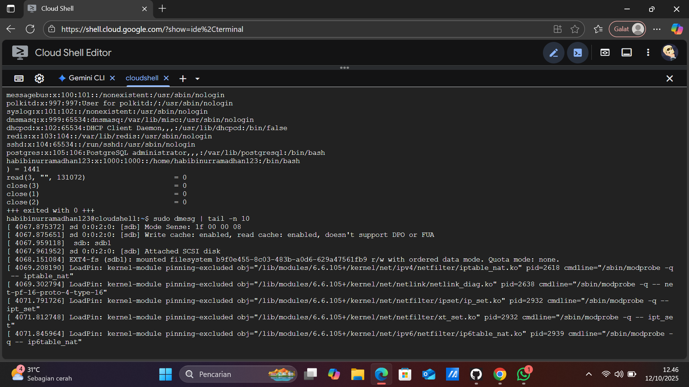
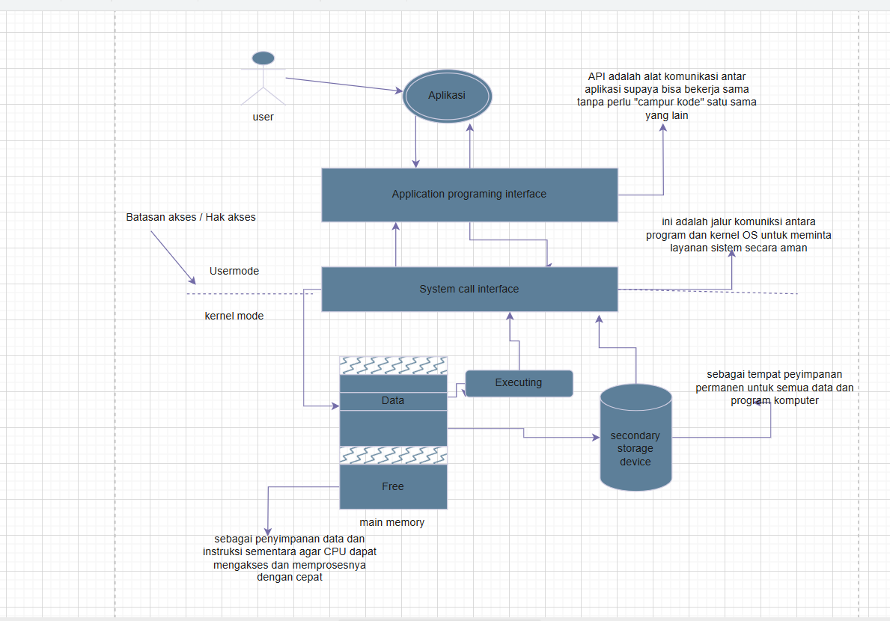

# Laporan Praktikum Minggu [2]
Topik: Struktur System Call dan Fungsi Kernel

---

## Identitas
- **Nama**  : M. Habibi Nur Ramadhan
- **NIM**   : 250202949 
- **Kelas** : 1IKRB 

---

## Tujuan
Setelah menyelesaikan tugas ini, mahasiswa mampu:

Menjelaskan konsep dan fungsi system call dalam sistem operasi.
Mengidentifikasi jenis-jenis system call dan fungsinya.
Mengamati alur perpindahan mode user ke kernel saat system call terjadi.
Menggunakan perintah Linux untuk menampilkan dan menganalisis system call.

---

## Dasar Teori
System call termasuk salah satu komponen kernel pada OS yang memiliki berbagai fungsi di antaranya untuk mengakses perangkat keras , mengelola proses, mengatur memori, mengatur komunikasi antar proses, dan menangani file dan direktori contohnya membuka, menutup, membuat dan menghapus file.


---

## Langkah Praktikum
1. **Setup Environment**
   - Gunakan Linux (Ubuntu/WSL).
   - Pastikan perintah `strace` dan `man` sudah terinstal.
   - Konfigurasikan Git (jika belum dilakukan di minggu sebelumnya).

2. **Eksperimen 1 – Analisis System Call**
   Jalankan perintah berikut:
   ```bash
   strace ls
   ```
   > Catat 5–10 system call pertama yang muncul dan jelaskan fungsinya.  
   Simpan hasil analisis ke `results/syscall_ls.txt`.

3. **Eksperimen 2 – Menelusuri System Call File I/O**
   Jalankan:
   ```bash
   strace -e trace=open,read,write,close cat /etc/passwd
   ```
   > Analisis bagaimana file dibuka, dibaca, dan ditutup oleh kernel.

4. **Eksperimen 3 – Mode User vs Kernel**
   Jalankan:
   ```bash
   dmesg | tail -n 10
   ```
   > Amati log kernel yang muncul. Apa bedanya output ini dengan output dari program biasa?

5. **Diagram Alur System Call**
   - Buat diagram yang menggambarkan alur eksekusi system call dari program user hingga kernel dan kembali lagi ke user mode.
   - Gunakan draw.io / mermaid.
   - Simpan di:
     ```
     praktikum/week2-syscall-structure/screenshots/syscall-diagram.png
     ```

6. **Commit & Push**
   ```bash
   git add .
   git commit -m "Minggu 2 - Struktur System Call dan Kernel Interaction"
   git push origin main
   ```

---


## Kode / Perintah
Tuliskan potongan kode atau perintah utama:

`strace ls`
`strace -e trace=open,read,write,close cat /etc/passwd`
`dmesg | tail -n 10`
```bash
Welcome to Cloud Shell! Type "help" to get started, or type "gemini" to try prompting with Gemini CLI.
To set your Cloud Platform project in this session use `gcloud config set project [PROJECT_ID]`.
You can view your projects by running `gcloud projects list`.
habibinurramadhan123@cloudshell:~$ strace ls
execve("/usr/bin/ls", ["ls"], 0x7ffd33f46ff0 /* 62 vars */) = 0
brk(NULL)                               = 0x56701a5e7000
mmap(NULL, 8192, PROT_READ|PROT_WRITE, MAP_PRIVATE|MAP_ANONYMOUS, -1, 0) = 0x7de656d63000
access("/etc/ld.so.preload", R_OK)      = -1 ENOENT (No such file or directory)
openat(AT_FDCWD, "/etc/ld.so.cache", O_RDONLY|O_CLOEXEC) = 3
fstat(3, {st_mode=S_IFREG|0644, st_size=35463, ...}) = 0
mmap(NULL, 35463, PROT_READ, MAP_PRIVATE, 3, 0) = 0x7de656d5a000
close(3)                                = 0
openat(AT_FDCWD, "/lib/x86_64-linux-gnu/libselinux.so.1", O_RDONLY|O_CLOEXEC) = 3
read(3, "\177ELF\2\1\1\0\0\0\0\0\0\0\0\0\3\0>\0\1\0\0\0\0\0\0\0\0\0\0\0"..., 832) = 832
fstat(3, {st_mode=S_IFREG|0644, st_size=174472, ...}) = 0
mmap(NULL, 181960, PROT_READ, MAP_PRIVATE|MAP_DENYWRITE, 3, 0) = 0x7de656d2d000
mmap(0x7de656d33000, 118784, PROT_READ|PROT_EXEC, MAP_PRIVATE|MAP_FIXED|MAP_DENYWRITE, 3, 0x6000) = 0x7de656d33000
mmap(0x7de656d50000, 24576, PROT_READ, MAP_PRIVATE|MAP_FIXED|MAP_DENYWRITE, 3, 0x23000) = 0x7de656d50000
mmap(0x7de656d56000, 8192, PROT_READ|PROT_WRITE, MAP_PRIVATE|MAP_FIXED|MAP_DENYWRITE, 3, 0x29000) = 0x7de656d56000
mmap(0x7de656d58000, 5832, PROT_READ|PROT_WRITE, MAP_PRIVATE|MAP_FIXED|MAP_ANONYMOUS, -1, 0) = 0x7de656d58000
close(3)                                = 0
openat(AT_FDCWD, "/lib/x86_64-linux-gnu/libc.so.6", O_RDONLY|O_CLOEXEC) = 3
read(3, "\177ELF\2\1\1\3\0\0\0\0\0\0\0\0\3\0>\0\1\0\0\0\220\243\2\0\0\0\0\0"..., 832) = 832
pread64(3, "\6\0\0\0\4\0\0\0@\0\0\0\0\0\0\0@\0\0\0\0\0\0\0@\0\0\0\0\0\0\0"..., 784, 64) = 784
fstat(3, {st_mode=S_IFREG|0755, st_size=2125328, ...}) = 0
pread64(3, "\6\0\0\0\4\0\0\0@\0\0\0\0\0\0\0@\0\0\0\0\0\0\0@\0\0\0\0\0\0\0"..., 784, 64) = 784
mmap(NULL, 2170256, PROT_READ, MAP_PRIVATE|MAP_DENYWRITE, 3, 0) = 0x7de656b1b000
mmap(0x7de656b43000, 1605632, PROT_READ|PROT_EXEC, MAP_PRIVATE|MAP_FIXED|MAP_DENYWRITE, 3, 0x28000) = 0x7de656b43000
mmap(0x7de656ccb000, 323584, PROT_READ, MAP_PRIVATE|MAP_FIXED|MAP_DENYWRITE, 3, 0x1b0000) = 0x7de656ccb000
mmap(0x7de656d1a000, 24576, PROT_READ|PROT_WRITE, MAP_PRIVATE|MAP_FIXED|MAP_DENYWRITE, 3, 0x1fe000) = 0x7de656d1a000
mmap(0x7de656d20000, 52624, PROT_READ|PROT_WRITE, MAP_PRIVATE|MAP_FIXED|MAP_ANONYMOUS, -1, 0) = 0x7de656d20000
close(3)                                = 0
openat(AT_FDCWD, "/lib/x86_64-linux-gnu/libpcre2-8.so.0", O_RDONLY|O_CLOEXEC) = 3
read(3, "\177ELF\2\1\1\0\0\0\0\0\0\0\0\0\3\0>\0\1\0\0\0\0\0\0\0\0\0\0\0"..., 832) = 832
fstat(3, {st_mode=S_IFREG|0644, st_size=625344, ...}) = 0
mmap(NULL, 627472, PROT_READ, MAP_PRIVATE|MAP_DENYWRITE, 3, 0) = 0x7de656a81000
mmap(0x7de656a83000, 450560, PROT_READ|PROT_EXEC, MAP_PRIVATE|MAP_FIXED|MAP_DENYWRITE, 3, 0x2000) = 0x7de656a83000
mmap(0x7de656af1000, 163840, PROT_READ, MAP_PRIVATE|MAP_FIXED|MAP_DENYWRITE, 3, 0x70000) = 0x7de656af1000
mmap(0x7de656b19000, 8192, PROT_READ|PROT_WRITE, MAP_PRIVATE|MAP_FIXED|MAP_DENYWRITE, 3, 0x97000) = 0x7de656b19000
close(3)                                = 0
mmap(NULL, 12288, PROT_READ|PROT_WRITE, MAP_PRIVATE|MAP_ANONYMOUS, -1, 0) = 0x7de656a7e000
arch_prctl(ARCH_SET_FS, 0x7de656a7e800) = 0
set_tid_address(0x7de656a7ead0)         = 2841
set_robust_list(0x7de656a7eae0, 24)     = 0
rseq(0x7de656a7f120, 0x20, 0, 0x53053053) = 0
mprotect(0x7de656d1a000, 16384, PROT_READ) = 0
mprotect(0x7de656b19000, 4096, PROT_READ) = 0
mprotect(0x7de656d56000, 4096, PROT_READ) = 0
mprotect(0x566fde1dc000, 8192, PROT_READ) = 0
mprotect(0x7de656d9b000, 8192, PROT_READ) = 0
prlimit64(0, RLIMIT_STACK, NULL, {rlim_cur=8192*1024, rlim_max=RLIM64_INFINITY}) = 0
munmap(0x7de656d5a000, 35463)           = 0
statfs("/sys/fs/selinux", 0x7ffe12f47b80) = -1 ENOENT (No such file or directory)
statfs("/selinux", 0x7ffe12f47b80)      = -1 ENOENT (No such file or directory)
getrandom("\xd6\xd5\xc1\x3e\xbf\x7e\x9b\x9c", 8, GRND_NONBLOCK) = 8
brk(NULL)                               = 0x56701a5e7000
brk(0x56701a608000)                     = 0x56701a608000
openat(AT_FDCWD, "/proc/filesystems", O_RDONLY|O_CLOEXEC) = 3
fstat(3, {st_mode=S_IFREG|0444, st_size=0, ...}) = 0
read(3, "nodev\tsysfs\nnodev\ttmpfs\nnodev\tbd"..., 1024) = 390
read(3, "", 1024)                       = 0
close(3)                                = 0
access("/etc/selinux/config", F_OK)     = -1 ENOENT (No such file or directory)
openat(AT_FDCWD, "/usr/lib/locale/locale-archive", O_RDONLY|O_CLOEXEC) = 3
fstat(3, {st_mode=S_IFREG|0644, st_size=3055776, ...}) = 0
mmap(NULL, 3055776, PROT_READ, MAP_PRIVATE, 3, 0) = 0x7de656793000
close(3)                                = 0
ioctl(1, TCGETS, {c_iflag=ICRNL|IXON|IUTF8, c_oflag=NL0|CR0|TAB0|BS0|VT0|FF0|OPOST|ONLCR, c_cflag=B38400|CS8|CREAD, c_lflag=ISIG|ICANON|ECHO|ECHOE|ECHOK|IEXTEN|ECHOCTL|ECHOKE, ...}) = 0
ioctl(1, TIOCGWINSZ, {ws_row=31, ws_col=159, ws_xpixel=0, ws_ypixel=0}) = 0
openat(AT_FDCWD, ".", O_RDONLY|O_NONBLOCK|O_CLOEXEC|O_DIRECTORY) = 3
fstat(3, {st_mode=S_IFDIR|0750, st_size=4096, ...}) = 0
getdents64(3, 0x56701a5edce0 /* 15 entries */, 32768) = 496
getdents64(3, 0x56701a5edce0 /* 0 entries */, 32768) = 0
close(3)                                = 0
fstat(1, {st_mode=S_IFCHR|0620, st_rdev=makedev(0x88, 0x7), ...}) = 0
write(1, "README-cloudshell.txt\n", 22README-cloudshell.txt
) = 22
close(1)                                = 0
close(2)                                = 0
exit_group(0)                           = ?
+++ exited with 0 +++
habibinurramadhan123@cloudshell:~$ strace -e trace=open,read,write,close cat /etc/passwd
close(3)                                = 0
read(3, "\177ELF\2\1\1\3\0\0\0\0\0\0\0\0\3\0>\0\1\0\0\0\220\243\2\0\0\0\0\0"..., 832) = 832
close(3)                                = 0
close(3)                                = 0
read(3, "root:x:0:0:root:/root:/bin/bash\n"..., 131072) = 1441
write(1, "root:x:0:0:root:/root:/bin/bash\n"..., 1441root:x:0:0:root:/root:/bin/bash
daemon:x:1:1:daemon:/usr/sbin:/usr/sbin/nologin
bin:x:2:2:bin:/bin:/usr/sbin/nologin
sys:x:3:3:sys:/dev:/usr/sbin/nologin
sync:x:4:65534:sync:/bin:/bin/sync
games:x:5:60:games:/usr/games:/usr/sbin/nologin
man:x:6:12:man:/var/cache/man:/usr/sbin/nologin
lp:x:7:7:lp:/var/spool/lpd:/usr/sbin/nologin
mail:x:8:8:mail:/var/mail:/usr/sbin/nologin
news:x:9:9:news:/var/spool/news:/usr/sbin/nologin
uucp:x:10:10:uucp:/var/spool/uucp:/usr/sbin/nologin
proxy:x:13:13:proxy:/bin:/usr/sbin/nologin
www-data:x:33:33:www-data:/var/www:/usr/sbin/nologin
backup:x:34:34:backup:/var/backups:/usr/sbin/nologin
list:x:38:38:Mailing List Manager:/var/list:/usr/sbin/nologin
irc:x:39:39:ircd:/run/ircd:/usr/sbin/nologin
_apt:x:42:65534::/nonexistent:/usr/sbin/nologin
nobody:x:65534:65534:nobody:/nonexistent:/usr/sbin/nologin
systemd-network:x:998:998:systemd Network Management:/:/usr/sbin/nologin
messagebus:x:100:101::/nonexistent:/usr/sbin/nologin
polkitd:x:997:997:User for polkitd:/:/usr/sbin/nologin
syslog:x:101:102::/nonexistent:/usr/sbin/nologin
dnsmasq:x:999:65534:dnsmasq:/var/lib/misc:/usr/sbin/nologin
dhcpcd:x:102:65534:DHCP Client Daemon,,,:/usr/lib/dhcpcd:/bin/false
redis:x:103:104::/var/lib/redis:/usr/sbin/nologin
sshd:x:104:65534::/run/sshd:/usr/sbin/nologin
postgres:x:105:106:PostgreSQL administrator,,,:/var/lib/postgresql:/bin/bash
habibinurramadhan123:x:1000:1000::/home/habibinurramadhan123:/bin/bash
) = 1441
read(3, "", 131072)                     = 0
close(3)                                = 0
close(1)                                = 0
close(2)                                = 0
+++ exited with 0 +++
habibinurramadhan123@cloudshell:~$ sudo dmesg | tail -n 10
[ 4067.875372] sd 0:0:2:0: [sdb] Mode Sense: 1f 00 00 08
[ 4067.875651] sd 0:0:2:0: [sdb] Write cache: enabled, read cache: enabled, doesn't support DPO or FUA
[ 4067.959118]  sdb: sdb1
[ 4067.961952] sd 0:0:2:0: [sdb] Attached SCSI disk
[ 4068.151084] EXT4-fs (sdb1): mounted filesystem b9f0e455-8c03-483b-a0d6-629a47561fb9 r/w with ordered data mode. Quota mode: none.
[ 4069.208190] LoadPin: kernel-module pinning-excluded obj="/lib/modules/6.6.105+/kernel/net/ipv4/netfilter/iptable_nat.ko" pid=2618 cmdline="/sbin/modprobe -q -- iptable_nat"
[ 4069.302794] LoadPin: kernel-module pinning-excluded obj="/lib/modules/6.6.105+/kernel/net/netlink/netlink_diag.ko" pid=2638 cmdline="/sbin/modprobe -q -- net-pf-16-proto-4-type-16"
[ 4071.791726] LoadPin: kernel-module pinning-excluded obj="/lib/modules/6.6.105+/kernel/net/netfilter/ipset/ip_set.ko" pid=2932 cmdline="/sbin/modprobe -q -- ipt_set"
[ 4071.812748] LoadPin: kernel-module pinning-excluded obj="/lib/modules/6.6.105+/kernel/net/netfilter/xt_set.ko" pid=2932 cmdline="/sbin/modprobe -q -- ipt_set"
[ 4071.845964] LoadPin: kernel-module pinning-excluded obj="/lib/modules/6.6.105+/kernel/net/ipv6/netfilter/ip6table_nat.ko" pid=2939 cmdline="/sbin/modprobe -q -- ip6table_nat"
```


---

## Hasil Eksekusi
Sertakan screenshot hasil percobaan atau diagram:




---

## Analisis
Tulis analisis 400–500 kata tentang:
Mengapa system call penting untuk keamanan OS?
Bagaimana OS memastikan transisi user–kernel berjalan aman?
Sebutkan contoh system call yang sering digunakan di Linux.

### 1. Mengapa system call penting untuk keamanan OS
Seperti yang kita ketahui bahwa system call itu berfungsi sebagai antar muka antara program pengguna  dan kernel OS, jika tidak ada system call tidak ada batasan akses pada usermode dan Kernel mode hal ini bisa berakibat kerusakan pada sistem atau crash. jadi system call ini sangat penting untuk keamanan pada sistem , selain itu system call juga berperan penting , di antaranya menjembatani program dan OS system call menyediakan metode standar bagi program aplikasi untuk meminta layanan dari OS contohnya membaca atau menulis file , membuat proses baru , ataupun melakukan operasi jaringan. Dan berperan untuk **manajemen sumber daya** system call disini berperan menempatkan dan melepaskan sumber daya sistem seperti contohnya CPU, memori, dan perangkat I/O. Juga pada unsur keamanan dan stabilitas , multitasking, interaksi perangkat keras, penanganan kesalahan, serta portabilitas. Dalam keamanan dan stabilitas: panggilan sistem memastikan program user tidak dapat mengakses sumberdaya perangkat keras secara langsung, mencegah program yang kurang aman mengganggu ataupun merusak sistem. OS memproses permintaan ini dengan aman melalui kernel, bahkan memisahkan antara program user dari kernel. Dalam multitasking system call disini mengelola banyak eksekusi proses sekaligus , contohnya saat sedang bermain game bisa dengan menjalankan program di balik layar seperti memutar musik, menerima telepon, bahkan aplikasi lain yang mendukung multitasking. Dalam **Interaksi perangkat keras:** Panggilan sistem mengabstraksikan kompleksitas perangkat keras, memungkinkan pengembang untuk berinteraksi dengan perangkat seperti printer, pemindai, atau hard disk tanpa harus mempelajari setiap detail teknis setiap perangkat. 
**Penanganan kesalahan:** Panggilan sistem memberi tahu program pengguna tentang kesalahan atau kondisi pengecualian, seperti file tidak ditemukan, dan membantu pemulihan kesalahan yang lancar, sehingga menjaga stabilitas sistem secara keseluruhan. 
Dan dalam **Portabilitas:** Panggilan sistem memberikan antarmuka yang standar dan portabel. Ini berarti program yang ditulis untuk menggunakan panggilan sistem dapat berjalan pada sistem operasi yang berbeda tanpa modifikasi besar, bahkan jika arsitektur perangkat kerasnya berbeda.

### 2.Bagaimana OS memastikan transisi user–kernel berjalan aman?
OS memastikan dalam mentrasisikan kedua mode ini antara usermode dan kernel mode menggunakan system call untuk mengontrol perpindahan ini, saat aplikasi user di klik ini akan memicu panggilan sistem, OS langsung beralih ke mode kernel, memproses, dan kembali lagi mode user setelah selesai memproses, sehingga ini dapat mencegah akses ke komponen system penting. Mekanisme keamanan Pada OS meliputi Pemisahan mode antara kernel mode dan user mode, panggilan sistem, Manajemen akses izin, perlindungan memori, Isolasi dan kompertementalisasi , pemeriksaan dan verifikasi. pemisahan antara dua mode user-kernel ini dibatasi untuk pengaksesan sumberdaya secara langsung pada user mode, sedangkan untuk kernel mode ini memiliki akses penuh kepada OS untuk mengelola perangkat keras, memori dan proses lainnya. Transisi mode user-kernel hanya dapat terjadi melalui panggilan system, yang merupakan antar muka yang terstruktur dari OS. Dalam manajemen akses dan izin OS dapat mengontrol siapa yang dapat mengakses sumber daya sistem dan menjalankan sebuah proses tertentu berdasarkan izin pengguna dan kebijakan keamanan dari kernel. Dalam perlindungan memori melindungi memori kernel dari akses yang kurang sah oleh aplikasi user. ini termasuk mekanisme seperti penghalang memori, agar dapat menghindari kebocoran data. Isolasi dan kompertementalisasi pada beberapa system menggunakan mekanisme safebox  untuk menjalankan operasi dari kernel yang kritis di lingkungan yang terisolasi. Dan dalam Pemeriksaan & verifikasi sebelum menjalankan permintaan dari user mode, OS akan memeriksa keamanan dan memastikan permintaan tersebut sah.

### 3.contoh system call yang sering digunakan di Linux.
contoh system call dari linux adalah open, close, read, write, fork, exec, exit, stat, istat, fstat, dan kill
* `open` membuka atau mebuat file
* `write` menulis data ke sebuah file descriptor.
* `read` membaca data dari sebuah file descriptor.
* `close` menutup file descriptor yang sebelum nya dibuka.
* `fork` membuat proses baru hasil duplikat proses saat ini.
* `exit` mengakhiri proses.
* `exec` mengganti proses.
* `stat, istat, fstat` mendapatkan informasi rinci sebuah file.
* `kill` mengirim sinyal ke sebuah proses.
### Tabel Analisis
| No | Perintah | Fungsi Perintah | Output | Analisis|
|----|-----------|----------------|------------------|------------------|
| 1 | strace ls | Melacak semua system call yang dijalankan oleh perintah ls. | openat(AT_FDCWD, "/etc/ld.so.cache", O_RDONLY|O_CLOEXEC) = 3 | Terlihat bahwa ls memanggil system call openat untuk membuka direktori dan membaca isinya. |
| 2 | strace -e trace=open,read,write,close cat /etc/passwd | untuk memfilter system call yang ingin di lacak. | read(3, "\177ELF\2\1\1\3\0\0\0\0\0\0\0\0\3\0>\0\1\0\0\0\220\243\2\0\0\0\0\0 | bisa melihat file apa saja yang dibuka cat. |
| 3 | dmesg | tail | Menampilkan pesan dari kernel pada saat sistem berjalan. | [ 4067.875372] sd 0:0:2:0: [sdb] Mode Sense: 1f 00 00 08 | Menunjukkan informasi kernel dan pesan inisialisasi sistem pada saat booting. |
  
Sumber:
* https://www.techtarget.com/searchsoftwarequality/tip/User-mode-vs-kernel-mode-OSes-explained#:~:text=Mode%20kernel%20berfungsi%20untuk%20mencegah,kesalahan%20terjadi%20dalam%20mode%20kernel.&text=Komputer%20memisahkan%20OS%20menjadi%20dua,sumber%20daya%20dan%20tujuan%20keamanan.
* https://www.scaler.com/topics/dual-mode-operation-in-os/
* https://jumpcloud.com/it-index/what-is-an-os-kernel#:~:text=merusak%20program%20lainnya.-,Keamanan,komponen%2Dkomponen%20sistem%20yang%20penting.


---

## Kesimpulan
* Pada kesimpulannya system call merupakan pintu masuk dari user program ke kernel OS dan merupakan salah satu komponen dari kernel.
* **strace ls , strace -e trace=open,read,write,close cat /etc/passwd, dan dmesg | tail -n 10** merupakan perintah  untuk memantau, menganalisis, dan memahami hubungan antara usermode dan kernel mode baik dari sisi system call maupun pesan sistem kernel.
  
---

## Quiz
1. Apa fungsi utama system call dalam sistem operasi?
   **Jawaban:**  System call itu berperan menjembatani antara program aplikasi dan OS dan memiliki beberapa fungsi utama untuk mengakses perangkat keras , mengelola proses, mengatur memori, mengatur komunikasi antar proses, serta mengatur file direktori.
2. Sebutkan 4 kategori system call yang umum digunakan.
   **Jawaban:**
   * **Pengendalian Proses (Process control)** dalam hal ini syscall mengatur proses program yang sedang berjalan seperti membuat, menjalankan, menghentikan, menunggu dan mendapatkan id proses.
   * **File management** dalam hal ini syscall digunakan untuk mengelola file dan direktori contohnya membuka, membaca, menulis, menutup, dan menghapus file.
   * **Device management** dalam hal ini syscall memiliki fungsi untuk berkomunikasi dengan input/output (I/O) contohnya mengatur kontrol, mengirim atau menerima data, dan meminta atau melepaskan perangkat.
   * **Information maintenance & communication** ini berfungsi untuk mendapatkan atau mengatur informasi sistem dan untuk kounikasi antar proces (IPC)
3. Mengapa system call tidak bisa dipanggil langsung oleh user program?
   **Jawaban:**  Karena hanya kernel yang memiliki hak untuk mengakses perangkat keras , lebih detail nya system call berhubungan langsung dengan hardware dan sumber daya penting sistem, klo program pengguna bisa mengakses itu semua maka bisa berakibat pada kerusakan sistem atau crash, keamanan terganggu, dan membuat sistem tidak stabil.

---

## Refleksi Diri
Tuliskan secara singkat:
- Apa bagian yang paling menantang minggu ini? Hal yang menantang pada minggu ini itu dalam mengoperasikan linux , dan dalam memahami materi yang cukup asing di kepala saya.
- Bagaimana cara Anda mengatasinya?  Intinya saya terus belajar dan harus mengorbankan waktu saya untuk memahami materi ini

---

**Credit:**  
_Template laporan praktikum Sistem Operasi (SO-202501) – Universitas Putra Bangsa_
