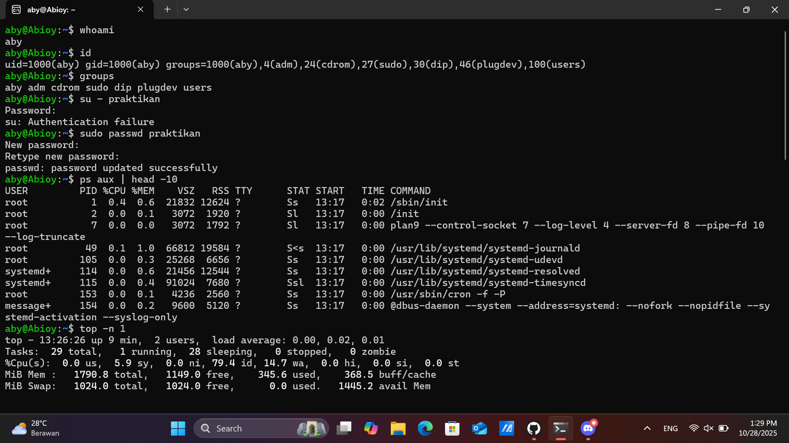
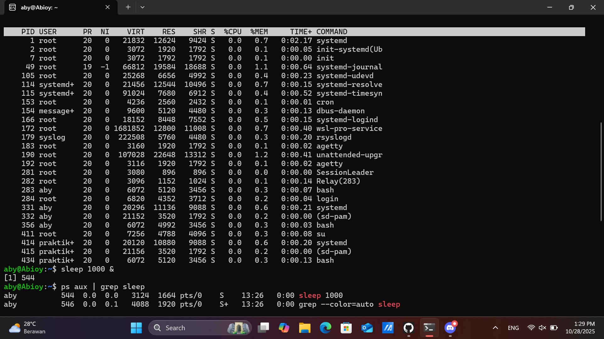
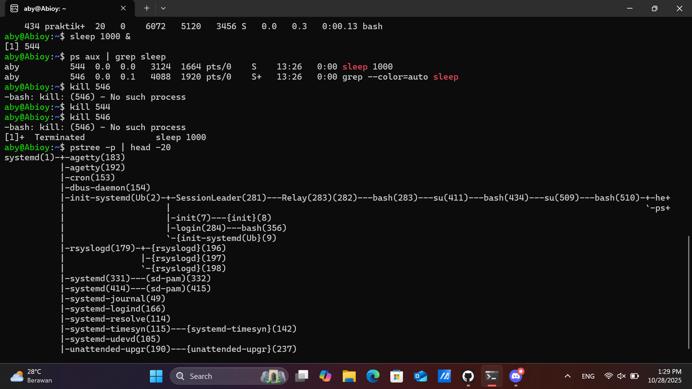

# Laporan Praktikum Minggu [4]
Topik: Manajemen Proses dan User di Linux


---

## Identitas
- **Nama**  : M. Habibi Nur Ramadhan
- **NIM**   : 250202949
- **Kelas** : 1 IKRB

---

## Tujuan
Tuliskan tujuan praktikum minggu ini.  
Contoh:  
Setelah menyelesaikan tugas ini, mahasiswa mampu:
Menjelaskan konsep proses dan user dalam sistem operasi Linux.
Menampilkan daftar proses yang sedang berjalan dan statusnya.
Menggunakan perintah untuk membuat dan mengelola user.
Menghentikan atau mengontrol proses tertentu menggunakan PID.
Menjelaskan kaitan antara manajemen user dan keamanan sistem.


---

## Dasar Teori
Proses adalah program yang sedang berjalan di sistem komputer. Pada linux, proses di kelola oleh kernel sistem operasi, mengalokasikan sumber daya sistem dan menajadwalkan proses untuk berjalan di CPU. Proses dapat dikategorikan menjadi proses latar depan, latar belakang, serta proses sistem dan pengguna.
Manajement proses di linux merupakan suatu skill yang penting bagi administrator dan pengembang linux.

Manajement proses disini melibatkan pengendalian dan pemantauan proses, yang berjalan termasuk mengelola sumberdaya proses menjadwalkan proses yang berjalan di CPU, dan menghentikan proses apabila diperlukan.Memahami berbagai jenis proses, statusnya, dan perintah yang tersedia untuk manajemen proses, seperti ps , top, kill, nice, dan renice , penting untuk mengelola proses secara efektif
 
**SUMBER**:scaler.com/topics/process-management-in-linux/


---

## Langkah Praktikum
1. **Setup Environment**
   - Gunakan Linux (Ubuntu/WSL).  
   - Pastikan Anda sudah login sebagai user non-root.  
   - Siapkan folder kerja:
     ```
     praktikum/week4-proses-user/
     ```

2. **Eksperimen 1 – Identitas User**
   Jalankan perintah berikut:
   ```bash
   whoami
   id
   groups
   ```
   - Jelaskan setiap output dan fungsinya.  
   - Buat user baru (jika memiliki izin sudo):
     ```bash
     sudo adduser praktikan
     sudo passwd praktikan
     ```
   - Uji login ke user baru.

3. **Eksperimen 2 – Monitoring Proses**
   Jalankan:
   ```bash
   ps aux | head -10
   top -n 1
   ```
   - Jelaskan kolom penting seperti PID, USER, %CPU, %MEM, COMMAND.  
   - Simpan tangkapan layar `top` ke:
     ```
     praktikum/week4-proses-user/screenshots/top.png
     ```

4. **Eksperimen 3 – Kontrol Proses**
   - Jalankan program latar belakang:
     ```bash
     sleep 1000 &
     ps aux | grep sleep
     ```
   - Catat PID proses `sleep`.  
   - Hentikan proses:
     ```bash
     kill <PID>
     ```
   - Pastikan proses telah berhenti dengan `ps aux | grep sleep`.

5. **Eksperimen 4 – Analisis Hierarki Proses**
   Jalankan:
   ```bash
   pstree -p | head -20
   ```
   - Amati hierarki proses dan identifikasi proses induk (`init`/`systemd`).  
   - Catat hasilnya dalam laporan.

6. **Commit & Push**
   ```bash
   git add .
   git commit -m "Minggu 4 - Manajemen Proses & User"
   git push origin main
   ```

---

## Kode / Perintah
`whoami `
`id `
`groups `
`sudo adduser praktikan`
`sudo passwd praktikan`
`ps aux | head -10`
`top -n 1`
`sleep 1000 &`
`ps aux | grep sleep`
`kill <PID>`
`pstree -p | head -20 `


### 1. Whoami
Pada perintah ini menunjukan nama user, `whoami` atau siapa saya, perintah ini untuk mengetahui siapa pengguna yang sedang aktif.

### 2. id 
Menunjukan informasi identitas pengguna seperti user id, group id dan groups

### 3. groups
Menampilkan nama groups user

### 4. sudo adduser praktikan
Membuat user baru lengkap dengan direktori home, shell login ,grup user , password , dan file konfigurasi awal.

### 5. sudo passwd praktikan
Untuk membuat pasword baru user.

### 6. ps aux | head -10
Untuk menampilkan daftar 10 proses pertama yang sedang berjalan di sistem linux.

### 7. top -n 1
Hanya menampilkan daftar proses yang sedang berjalan hanya satu kali dan langsung keluar.

### 8. sleep 1000 &
Untuk menjeda eksekusi terminal atau skrip selama 1000 detik sebelum lanjut ke perintah berikutnya.

### 9. ps aux | grep sleep
Untuk mencari dan menampilkan proses sleep yang sedang berjalan.

### 10. kill <PID>
Menghentikan proses sleep.

### 11. pstree -p | head -20 
untuk menampilkan 20 baris pertama dari daftar proses sistem dalam bentuk struktur pohon, lengkap dengan PID nya.


---

## Hasil Eksekusi
Sertakan screenshot hasil percobaan atau diagram:



---

## Analisis
1. Dokumentasikan hasil semua perintah dan jelaskan fungsi tiap perintah.  
2. Gambarkan hierarki proses dalam bentuk diagram pohon (`pstree`) di laporan.  
3. Jelaskan hubungan antara user management dan keamanan sistem Linux.  
4. Upload laporan ke repositori Git tepat waktu.
### Hasil perintah dan fungsinya dalam bentuk tabel.
| perintah | fungsi perintah | output hasil eksekusi | 
|-----------|-----------------|------------------------|
| Whoami |  menunjukan nama user | aby |
| id | Menunjukan informasi identitas pengguna seperti user id, group id dan groups | uid=1000(aby) gid=1000(aby) groups=1000(aby) |
| groups | Menampilkan nama groups user | aby adm cdrom sudo dip plugdev users |
| sudo adduser praktikan | Membuat user baru lengkap dengan direktori home, shell login ,grup user , password , dan file konfigurasi awal. | Password: |
| sudo passwd praktikan | Untuk membuat pasword baru user. | New password:Retype new password: passwd: password updated successfully |
| ps aux  head -10 | Untuk menampilkan daftar 10 proses pertama yang sedang berjalan di sistem linux. | USER         PID %CPU %MEM    VSZ   RSS TTY      STAT START   TIME COMMAND... |
| top -n 1 | menampilkan daftar proses yang sedang berjalan hanya satu kali dan langsung keluar. |top - 13:26:26 up 9 min,  2 users,  load average: 0.00, 0.02, 0.01... |
| sleep 1000 & | menjeda eksekusi terminal atau skrip selama 1000 detik sebelum lanjut ke perintah berikutnya.| [1] 544 |
| ps aux grep sleep | mencari dan menampilkan proses sleep yang sedang berjalan. | aby          544  0.0  0.0   3124  1664 pts/0    S    13:26   0:00 sleep 1000 |
| kill <PID> | menghentikan proses sleep. | [1]+  Terminated              sleep 1000 |
| 11. pstree -p  head -20 | menampilkan 20 baris pertama dari daftar proses sistem | systemd(1)-+-agetty(183)... |


### Diagram pohon (`pstree`)
```bash
systemd(1)-+-agetty(183)
           |-agetty(192)
           |-cron(153)
           |-dbus-daemon(154)
           |-init-systemd(Ub(2)-+-SessionLeader(281)---Relay(283)(282)---bash(283)---su(411)---bash(434)---su(509)---bash(510)-+-he+
           |                    |                                                                                              `-ps+
           |                    |-init(7)---{init}(8)
           |                    |-login(284)---bash(356)
           |                    `-{init-systemd(Ub}(9)
           |-rsyslogd(179)-+-{rsyslogd}(196)
           |               |-{rsyslogd}(197)
           |               `-{rsyslogd}(198)
           |-systemd(331)---(sd-pam)(332)
           |-systemd(414)---(sd-pam)(415)
           |-systemd-journal(49)
           |-systemd-logind(166)
           |-systemd-resolve(114)
           |-systemd-timesyn(115)---{systemd-timesyn}(142)
           |-systemd-udevd(105)
           |-unattended-upgr(190)---{unattended-upgr}(237)
```

 Tanpa manajemen pengguna yang baik atau dalam artian (efektif), sistem Linux akan rentan terhadap akses ilegal dan berakibat pada penyalahgunaan, serta membahayakan data dan fungsiny. Jadi fungsi manajement proses itu untuk mengontrol siapa yang dapat mengakses sistem dan apa yang dapat mereka lakukan di dalamnya. jadi hubungan antara manajement sistem dan keamanan sistem linux terlihat pada beberapa aspek, Prinsip hak istimewa minimal , Autentikasi yang kuat baik itu kata sandi yang aman dan Autentikasi multifaktor (MFA), Kontrol akses berbasis peran (RBAC),  Akuntabilitas dan audit, Pengelolaan akun yang efektif, Isolasi dan sandboxing.

---

## Kesimpulan
1. Dapat kita simpulkan jadi manajemen proses dan keamanan sitem linux itu berhubungan erat berfungsi untuk mengontrol siapa yang dapat mengakses sistem tanpa manajemen proses mungkin sangat rentan terhadap akses yang tidak sah.
2. Perintah seperti ps, sleep, dan kill digunakan untuk mengelola proses yang berjalan pada sistem operasi linux.
3. kita simpulkan manajemen proses itu fungsi inti sistem operasi yang mengelola program yang sedang berjalan (proses) dengan cara membuat, menjadwalkan, menghentikan, dan menyinkronisasi proses agar sistem dapat berjalan secara efisien dan stabil.


---

## Quiz
1. Apa fungsi dari proses `init` atau `systemd` dalam sistem Linux?  
   **Jawaban:** Proses init atau systemd dalam linux berfungsi sebagai proses pertama (PID1) yang dijalan kan kernel setelah system booting. Baik init ataupun systemd bertanggung jawab untuk mengelola proses boot. Memulai dan menghentikan layanan, serta menangani penghentian sistem walaupun begitu keduanya berbeda dalam hal desain, fungsional, dan kinerjanya.
2. Apa perbedaan antara `kill` dan `killall`?
   **Jawaban:**  jadi perintah *kill* berfungsi untuk menghentikan proses dan *killall* itu dapat menghentikan beberapa proses secara bersamaan. *Kill* menghentikan proses tertentu berdasarkan ID Proses (PID) unik. Sedangkan *killall* Menghentikan semua instance dari sebuah program dengan cepat dan mudah.
3. Mengapa user `root` memiliki hak istimewa di sistem Linux?
   **Jawaban:**  Karena user root memiliki hak akses tanpa batas kita bisa mengartikan bahwa user root ini tidak dibatasi dengan izin sistem , dan dapat mengakses, mengubah, menghapus semua file dan direktori di sistem. Akun root penting untuk fungsi dasar sistem linux bahkan ketika akun ini tidak dapat di akses secara langsung, akun ini tetap berjalan di latar belakang untuk menyelesaikan tugas-tugas penting.

---

## Refleksi Diri
Tuliskan secara singkat:
- Apa bagian yang paling menantang minggu ini?  Yang sulit bagi saya bagian minggu ini yaitu mengaitkan dan memahami konsep manajement proses dan user di linux, serta memahami fungsi perintah ps, pstree, dan kill.
- Bagaimana cara Anda mengatasinya? belajar dan terus belajar.


---

**Credit:**  
_Template laporan praktikum Sistem Operasi (SO-202501) – Universitas Putra Bangsa_

