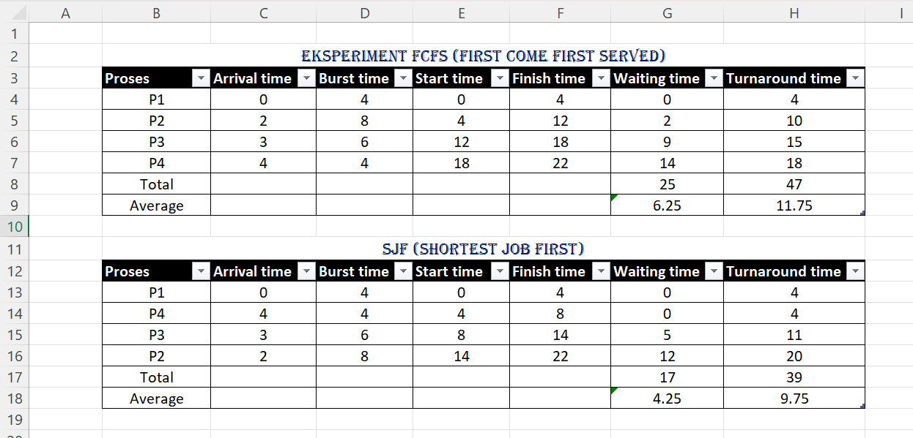
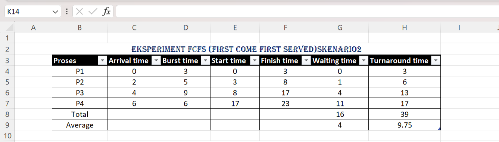
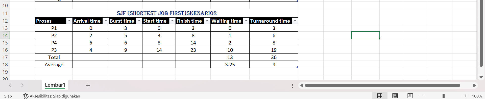

# Laporan Praktikum Minggu [5]
Topik: Penjadwalan CPU – FCFS dan SJF

---

## Identitas
- **Nama**  : M. Habibi Nur Ramadhan
- **NIM**   : 250202949
- **Kelas** : 1 IKRB

---

## Tujuan
Setelah menyelesaikan tugas ini, mahasiswa mampu:
1. Menghitung *waiting time* dan *turnaround time* untuk algoritma FCFS dan SJF.  
2. Menyajikan hasil perhitungan dalam tabel yang rapi dan mudah dibaca.  
3. Membandingkan performa FCFS dan SJF berdasarkan hasil analisis.  
4. Menjelaskan kelebihan dan kekurangan masing-masing algoritma.   
5. Menyimpulkan kapan algoritma FCFS atau SJF lebih sesuai digunakan.  

---

## Dasar Teori
Penjadwalan adalah dasar dari sistem operasi (OS) dalam multiprogramming computer karena dengan mengatur aliran dari proses-proses yang ada pada sebuah antriansistem operasi akan membuat sistem komputer menjadi lebih produktif dan efisien. Sasaran multiprogramming adalah mempunyai proses yang tereksekusi di setiap waktu sehingga utilisasidari pemroses menjadi lebih baik. 
Ada 2 jenis Algoritma proses yang akan di pelajari yaitu:
 * FCFS (First come first served)
 * SJF (Shortest job First)

 sumber: Jurnal Teknik Komputer Unikom – Komputika – Volume 3, No. 2 – 2014


---

## Langkah Praktikum
1. **Siapkan Data Proses**
   Gunakan tabel proses berikut sebagai contoh (boleh dimodifikasi dengan data baru):
   | Proses | Burst Time | Arrival Time |
   |:--:|:--:|:--:|
   | P1 | 6 | 0 |
   | P2 | 8 | 1 |
   | P3 | 7 | 2 |
   | P4 | 3 | 3 |

2. **Eksperimen 1 – FCFS (First Come First Served)**
   - Urutkan proses berdasarkan *Arrival Time*.  
   - Hitung nilai berikut untuk tiap proses:
     ```
     Waiting Time (WT) = waktu mulai eksekusi - Arrival Time
     Turnaround Time (TAT) = WT + Burst Time
     ```
   - Hitung rata-rata Waiting Time dan Turnaround Time.  
   - Buat Gantt Chart sederhana:  
     ```
     | P1 | P2 | P3 | P4 |
     0    6    14   21   24
     ```

3. **Eksperimen 2 – SJF (Shortest Job First)**
   - Urutkan proses berdasarkan *Burst Time* terpendek (dengan memperhatikan waktu kedatangan).  
   - Lakukan perhitungan WT dan TAT seperti langkah sebelumnya.  
   - Bandingkan hasil FCFS dan SJF pada tabel berikut:

     | Algoritma | Avg Waiting Time | Avg Turnaround Time | Kelebihan | Kekurangan |
     |------------|------------------|----------------------|------------|-------------|
     | FCFS | ... | ... | Sederhana dan mudah diterapkan | Tidak efisien untuk proses panjang |
     | SJF | ... | ... | Optimal untuk job pendek | Menyebabkan *starvation* pada job panjang |

4. **Eksperimen 3 – Visualisasi Spreadsheet (Opsional)**
   - Gunakan Excel/Google Sheets untuk membuat perhitungan otomatis:
     - Kolom: Arrival, Burst, Start, Waiting, Turnaround, Finish.
     - Gunakan formula dasar penjumlahan/subtraksi.
   - Screenshot hasil perhitungan dan simpan di:
     ```
     praktikum/week5-scheduling-fcfs-sjf/screenshots/
     ```

5. **Analisis**
   - Bandingkan hasil rata-rata WT dan TAT antara FCFS & SJF.  
   - Jelaskan kondisi kapan SJF lebih unggul dari FCFS dan sebaliknya.  
   - Tambahkan kesimpulan singkat di akhir laporan.

6. **Commit & Push**
   ```bash
   git add .
   git commit -m "Minggu 5 - CPU Scheduling FCFS & SJF"
   git push origin main
   ```


---

## Kode / Perintah
Tuliskan potongan kode atau perintah utama:


     Waiting Time (WT) = waktu mulai eksekusi - Arrival Time
     Turnaround Time (TAT) = WT + Burst Time
     Hitung rata-rata Waiting Time dan Turnaround Time.  
     Buat Gantt Chart sederhana: 


---

## Hasil Eksekusi
 Hasil modifikasi
 | Proses | Burst Time | Arrival Time |
   |:--:|:--:|:--:|
   | P1 | 4 | 0 |
   | P2 | 8 | 2 |
   | P3 | 6 | 3 |
   | P4 | 4 | 4 |

Sertakan screenshot hasil percobaan atau diagram: 
Proses pada skenario 1


### Hasil eksperiment - 1. FCFS (First Come First Served)
FCFS eksekusi pada proses tidak dapat di ganggu , tidak dapat di trobos antriannya.


 * **Gantt Chart FCFS SK1:**
  ```
   | P1 | P2 | P3 | P4 |
   0    4    12   18   22
   ```
     
* **Tabel eksperiment 1. FCFS**

| Proses | Arrival Time | Burst Time | Start Time | Finish Time | Waiting Time | Turnaround Time |
   | :--- | :--- | :--- | :--- | :--- | :--- | :--- |
   | P1 | 0 | 4 | 0 | 4 | 0 | 4 |
   | P2 | 2 | 8 | 4 | 12 | 2 | 10 |
   | P3 | 3 | 6 | 12 | 18 | 9 | 15 |
   | P4 | 4 | 4 | 18 | 22 | 14 | 18|
   | Total | | | | | 25 | 47 |
   | Average | | | | | 6,25 | 11,75 |

### **FCFS SKENARIO 2**


* **Gantt Chart FCFS SK2:**
  ```
   | P1 | P2 | P3 | P4 |
   0    3    8    17    23
   ```

### Hasil eksperiment - 2. SJF (Shortest Job First)
Berbeda dengan FCFS , pada proses SJF memungkinkan proses yang memiliki waktu eksekusi paling cepat akan di utamakan.
P1>P4>P3>P2.


* **Gantt Chart SJF SK1:**
  ```
   | P1 | P4 | P3 | P2 |
   0    4    8   14   22
   ```
* **Tabel eksperiment 2. SJF**

| Proses | Arrival Time | Burst Time | Start Time | Finish Time | Waiting Time | Turnaround Time |
   | :--- | :--- | :--- | :--- | :--- | :--- | :--- |
   | P1 | 0 | 4 | 0 | 4 | 0 | 4 |
   | P4 | 4 | 4 | 4 | 8 | 0 | 4 |
   | P3 | 3 | 6 | 8 | 14 | 5 | 11 |
   | P2 | 2 | 8 | 14 | 22 | 12 | 20 |
   | Total | | | | | 17 | 39 |
   | Average | | | | | 4,25 | 9,75 |

   ### **SJF SKENARIO 2**


* **Gantt Chart SJF SK2:**
  ```
   | P1 | P2 | P4 | P3 |
   0    3    8    14   23
   ```

## Eksperimen - 3 Perbandingan FCFS dan SJF
PERBANDINGAN SK1
   | Algoritma | Avg Waiting Time | Avg Turnaround Time | Kelebihan | Kekurangan |
   | :--- | :--- | :--- | :--- | :--- |
   | FCFS | 6,25 | 11,75 | lebih sederhana | waktu tunggu yang rata rata lama |
   | SJF | 4,25 | 9,75	| waktu tunggu rata rata yang pendek dan performa nya optimal | kesulitan memprediksi waktu dan potensi |


PERBANDINGAN SK2
   | Algoritma | Avg Waiting Time | Avg Turnaround Time | Kelebihan | Kekurangan |
   | :--- | :--- | :--- | :--- | :--- |
   | FCFS | 4 | 9,75 | lebih sederhana | waktu tunggu yang rata rata lama |
   | SJF | 3,25 | 9 | waktu tunggu rata rata yang pendek dan performa nya optimal | kesulitan memprediksi waktu dan potensi |


---

## Analisis
Analisis kelebihan dan kelemahan tiap algoritma. 
### Analisis FCFS (First Come First Served)
Sesuai dengan namanya First Come First Served, algoritma ini menjadwalkan eksekusi proses berdasarkan urutan kedatangannya, pada mekanisme antreannya proses yang datang dan siap di eksekusi di tempatkan di akhir antrean siap. FCFS bersifat non-preemtif, setelah sesuatu proses akan mulai di eksekusi , CPU akan tetap berada di dalam nya untuk memproses hingga proses tersebut berhenti atau beralih ke status menunggu.
kelebihan dari FCFS : 
 * **Sederhana dan mudah dalam pengimplementasiannya**, struktur data antrean dasarnya sudah cukup untuk mengelola proses (sesuai urutan kedatangan).
 * **Struktur antrean yang adil** , mematuhi aturan kedatangan proses secara ketat, tidak ada prioritas khusus kepada satu proses. Bisa kita lihat dari hasil praktik P1 diproses > P2 yang memiliki waktu eksekusi 8 , menunggu untuk di eksekusi > P3 BT= 6 , menunggu > P4 BT= 4 , menunggu dan akan di proses sesuai urutan.
 Kekurangan nya : 
 * **Efek konvoi**, ini adalah kelemahan yang paling utama, efek ini akan terjadi ketika beberapa proses panjang menghambat CPU contoh nya pada P4 yang hanya memiliki waktu eksekusi 4 , tapi karna datang terakhir ini mengakibatkan waktu tunggu yang sangat tinggi karena P4 di eksekusi di akhir, hal ini akan meningkatkan rata-rata dari waktu tunggu.

### Analisis SJF (Shortest Job First)
Shortest job first, sesuai dengan namanya yang artinya yang tercepat dikerjakan pertama. Algoritma ini terbukti efisien dalam mengurangi waktu rata-rata eksekusi proses. SJF bisa di implementasikan secara preemtif maupun non-preemtif.
Kelebihan dari SJF :
* **Waktu tunggu rata-rata yang minimal**, SJF sangat optimal dalam mengurangi waktu rata-rata dalam proses.
* **Jumlah proses yang di selesaikan lebih banyak yang diselesaikan persatuan waktu**, ya karena proses yang lebih cepat eksekusinya akan cepat selesai dan berganti ke proses lainya.
Kekurangannya :
* **Persyaratan pengetahuan burst time**, untuk memprediksi kebutuhan waktu CPU yang tepat sering kali tidak praktis dan menyebabkan keputusan jadwal yang tidak akurat.
* **Kelaparan proses yang lebih panjang**, Proses panjang akan selalu tertunda jika proses pendek selalu berdatangan.

Jadi dari kedua algoritma proses ini, yang lebih unggul dalam hasil praktik ini adalah SJF, karena rata rata waktu tunggu dan penyelesaian lebih cepat, di bandingkan dengan FCFS.

---

## Kesimpulan
Penjadwalan proses berperan penting dalam memastikan kinerja sistem operasi yang efisien, adil, dan responsif terhadap kebutuhan pengguna maupun proses yang berjalan bersamaan.

Dalam praktik ini kita bisa simpulkan , SJF sangat optimal dalam masalah waktu rata-rata tunggu dan waktu penyelesaian di karenakan SJF mengeksekusi proses yang memiliki waktu terpendek.

FCFS sangat sederhana untuk pengimplementasiannya, tetapi dalam masalah waktu tunggu dan waktu penyelesaian masih cukup tinggi, di bandingkan dengan SJF.

Dapat di simpulkan kedua algoritma proses ini memiliki kekurangan dan kelebihannya masing-masing.

---

## Quiz
1. Apa perbedaan utama antara FCFS dan SJF? 
   **Jawaban:**  Perbedaan utama pada FCFS dan SJF itu terletak pada scedulingnya atau penjadwalan pada proses nya, FCFS lebih ke mengeksekusi proses sesuai dengan urutan kedatangan, sedangkan untuk SJF ke arah mengutamakan proses yang eksekusinya lebih cepat walaupun dia datang terakhir.
2. Mengapa SJF dapat menghasilkan rata-rata waktu tunggu minimum?   
   **Jawaban:** Ini terjadi karena SJF mengutamakan proses yang eksekusinya lebih cepat terlebih dahulu. Dengan mengeksekusi proses yang cepat, SJF sangat efektif mengurangi waktu tunggu untuk banyak proses kecil lainya, karena dalam FCFS pastinya proses yg eksekusinya cepat tapi datang terakhir tidak akan menjadi prioritas , yang mengakibatkan antri lebih lama untuk proses kecil. 
3. Apa kelemahan SJF jika diterapkan pada sistem interaktif?  
   **Jawaban:**  Kelemahan jika SJF di terapkan pada sistem interaktif yaitu memunculkan potensi starvation (kelaparan) proses waktu eksekusi yang lama mungkin tidak akan pernah mendapatkan jatah jika proses pendek mulai berdatangan ke antrian, karena pada proses SJF lebih memprioritaskan yang lebih pendek. Waktu respon yang tidak konsisten , atau waktu tidak dapat di prediksi untuk semua permintaan. Kebutuhan untuk mengetahui waktu eksekusi di muka , dalam sistem interaktif mustahil untuk memprediksi secara akurat berapa lama waktu yang di butuhkan oleh pengguna untuk menyelesaikan interaksi. Serta tidak cocok untuk penjadwalan jangka pendek .

---

## Refleksi Diri
Tuliskan secara singkat:
- Apa bagian yang paling menantang minggu ini?  Dalam minggu ini materi tentang penjadwalan saya sudah cukup paham dengan mekanisme cara kerjanya , tetapi masih agak kesulitan untuk menghitung waktu hitungan pada tabel, saya bisa tetapi otak saya agak lemot untuk merespon dan memerlukan waktu agak lama untuk melakukan perhitungan.
- Bagaimana cara Anda mengatasinya?  Belajar dan terus belajar.

---

**Credit:**  
_Template laporan praktikum Sistem Operasi (SO-202501) – Universitas Putra Bangsa_
