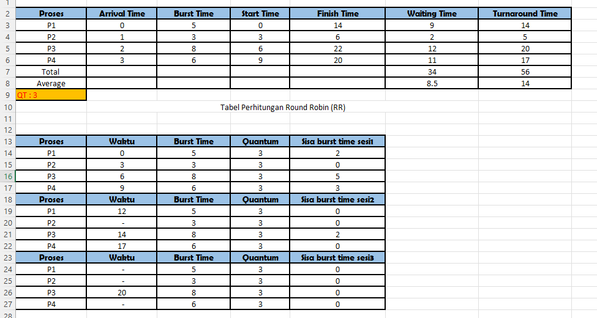
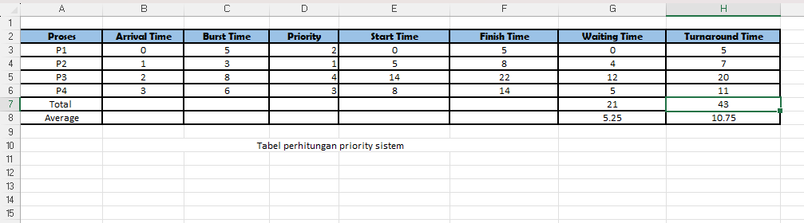
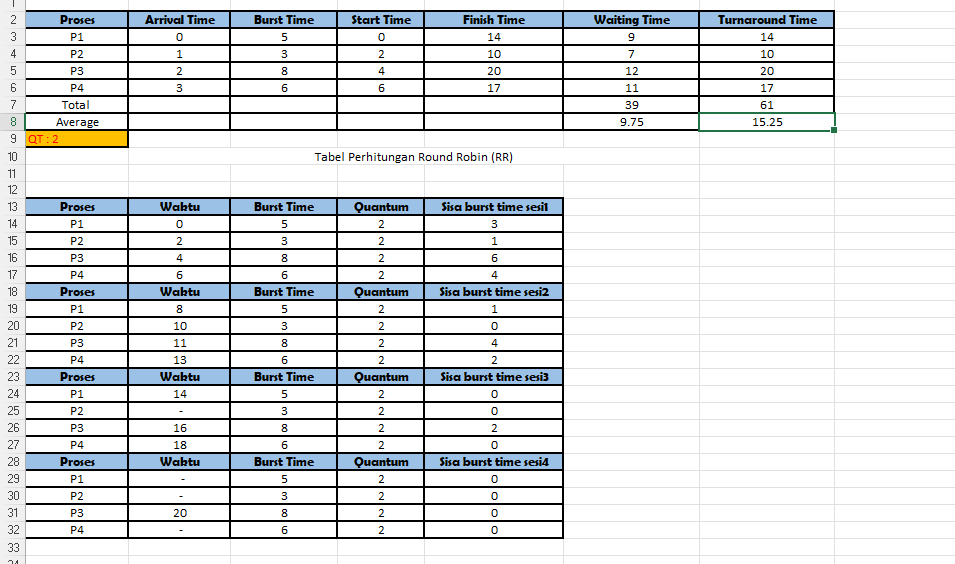
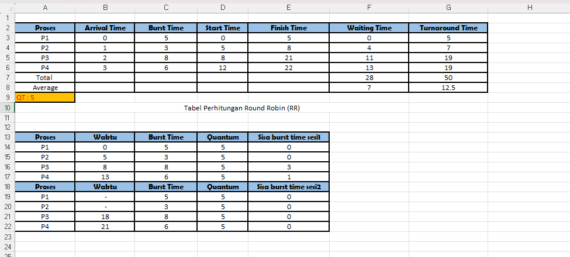

# Laporan Praktikum Minggu 6
Topik: Penjadwalan CPU – Round Robin (RR) dan Priority Scheduling

---

## Identitas
- **Nama**  : M. Habibi Nur Ramadhan  
- **NIM**   : 250202949
- **Kelas** : 1IKRB

---

## Tujuan
Tuliskan tujuan praktikum minggu ini. 
Setelah menyelesaikan tugas ini, mahasiswa mampu:
1. Menghitung *waiting time* dan *turnaround time* pada algoritma RR dan Priority.  
2. Menyusun tabel hasil perhitungan dengan benar dan sistematis.  
3. Membandingkan performa algoritma RR dan Priority.  
4. Menjelaskan pengaruh *time quantum* dan prioritas terhadap keadilan eksekusi proses.  
5. Menarik kesimpulan mengenai efisiensi dan keadilan kedua algoritma.  


---

## Dasar Teori
 Round Robin (RR) adalah sebuah algoritma penjadwalan CPU yang dirancang untuk sistem timesharing dan memastikan setiap proses mendapatkan waktu CPU yang adil. Algoritma ini mirip dengan FCFS bersifat preemtive tetapi dengan batasan waktu eksekusi, pada algoritma ini semua proses mendapatkan jatah waktu CPU yang tetap, yang biasa di sebut quantum time.Tujuan Utama: Untuk memberikan waktu respons yang cepat (responsiveness) dan menghindari monopoli CPU oleh satu proses yang berjalan lama, sehingga cocok untuk sistem interaktif. 

 Priority Scheduling adalah algoritma penjadwalan yang mengalokasikan CPU berdasarkan tingkat kepentingan atau prioritas.Algoritma ini didasarkan pada gagasan bahwa beberapa tugas lebih penting daripada yang lain dan harus didahulukan.

Referensi:
1.Silberschatz, Abraham, Peter Baer Galvin, dan Greg Gagne. Operating System Concepts. Edisi terbaru (umumnya edisi ke-9 atau ke-10). John Wiley & Sons.

---

## Langkah Praktikum
1. **Siapkan Data Proses**
   Gunakan contoh data berikut (boleh dimodifikasi sesuai kebutuhan):
   | Proses | Burst Time | Arrival Time | Priority |
   |:--:|:--:|:--:|:--:|
   | P1 | 5 | 0 | 2 |
   | P2 | 3 | 1 | 1 |
   | P3 | 8 | 2 | 4 |
   | P4 | 6 | 3 | 3 |

2. **Eksperimen 1 – Round Robin (RR)**
   - Gunakan *time quantum (q)* = 3.  
   - Hitung *waiting time* dan *turnaround time* untuk tiap proses.  
   - Simulasikan eksekusi menggunakan Gantt Chart (manual atau spreadsheet).  
     ```
     | P1 | P2 | P3 | P4 | P1 | P3 | ...
     0    3    6    9   12   15   18  ...
     ```
   - Catat sisa *burst time* tiap putaran.

3. **Eksperimen 2 – Priority Scheduling (Non-Preemptive)**
   - Urutkan proses berdasarkan nilai prioritas (angka kecil = prioritas tinggi).  
   - Lakukan perhitungan manual untuk:
     ```
     WT[i] = waktu mulai eksekusi - Arrival[i]
     TAT[i] = WT[i] + Burst[i]
     ```
   - Buat tabel perbandingan hasil RR dan Priority.

4. **Eksperimen 3 – Analisis Variasi Time Quantum (Opsional)**
   - Ubah *quantum* menjadi 2 dan 5.  
   - Amati perubahan nilai rata-rata *waiting time* dan *turnaround time*.  
   - Buat tabel perbandingan efek *quantum*.

5. **Eksperimen 4 – Dokumentasi**
   - Simpan semua hasil tabel dan screenshot ke:
     ```
     praktikum/week6-scheduling-rr-priority/screenshots/
     ```
   - Buat tabel perbandingan seperti berikut:

     | Algoritma | Avg Waiting Time | Avg Turnaround Time | Kelebihan | Kekurangan |
     |------------|------------------|----------------------|------------|-------------|
     | RR | ... | ... | Adil terhadap semua proses | Tidak efisien jika quantum tidak tepat |
     | Priority | ... | ... | Efisien untuk proses penting | Potensi *starvation* pada prioritas rendah |

6. **Commit & Push**
   ```bash
   git add .
   git commit -m "Minggu 6 - CPU Scheduling RR & Priority"
   git push origin main
   ```


---

## Kode / Perintah
 **Round Robin (RR)**
   - Gunakan *time quantum (q)* = 3.  
   - Hitung *waiting time* dan *turnaround time* untuk tiap proses.  
   - Simulasikan eksekusi menggunakan Gantt Chart (manual atau spreadsheet).  
     ```
     | P1 | P2 | P4 | P3 | P1 | P3 | ...
     0    3    6    9   12   15   18  ...
     ```
**Priority Scheduling (Non-Preemptive)**
   - Urutkan proses berdasarkan nilai prioritas (angka kecil = prioritas tinggi).  
   - Lakukan perhitungan manual untuk:
     ```
     WT[i] = waktu mulai eksekusi - Arrival[i]
     TAT[i] = WT[i] + Burst[i]
     ```
   - Buat tabel perbandingan hasil RR dan Priority.
**Analisis Variasi Time Quantum (Opsional)**
   - Ubah *quantum* menjadi 2 dan 5.  
   - Amati perubahan nilai rata-rata *waiting time* dan *turnaround time*.  
   - Buat tabel perbandingan efek *quantum*.

---

## Hasil Eksekusi
Sertakan screenshot hasil percobaan atau diagram:
| Proses | Burst Time | Arrival Time | Priority |
   |:--:|:--:|:--:|:--:|
   | P1 | 5 | 0 | 2 |
   | P2 | 3 | 1 | 1 |
   | P3 | 8 | 2 | 4 |
   | P4 | 6 | 3 | 3 |

### **Eksperiment - 1.Round Robin (RR) dengan quantum 3**


   ### **Gantt chart RR QT = 3**
   ```
     | P1 | P2 | P3 | P4 | P1 | P3 | P4 | P3 |
     0    3    6    9   12   14   17    20   22
   ```
### **Eksperimen 2 – Priority Scheduling (Non-Preemptive)**




   ### **Gantt chart Priority scheduling**
 ```  
 | P1 | P2 | P4 | P3 | 
 0    5    8    14   22
 ```


### **Eksperiment - 3.Round Robin (RR) dengan quantum 2 dan 5**

### Gant chart QT 2
 ```
 | P1 | P2 | P3 | P4 | P1 | P2 | P3 | P4 | P1 | P3 | P4 | P3 |
 0    2    4    6    8    10   11   13   14   16   18   20   22
 ```
 ### Gant chart QT 5

```
| P1 | P2 | P3 | P4 | P3 | P4 |
0    5    8    13   18   21   22
```
### **Eksperiment - 4. Tabel perbandingan**
Berdasarkan tabel eksperiment 1 dan 2 :

| Algoritma | Avg Waiting Time | Avg Turnaround Time | Kelebihan | Kekurangan |
 |------------|------------------|----------------------|------------|-------------|
 | RR | 8,5 | 14 | Adil terhadap semua proses | Tidak efisien jika quantum tidak tepat |
 | Priority | 5,25 | 10,75 | Efisien untuk proses penting | Potensi *starvation* pada prioritas rendah |

---

## Analisis

Dari perbandingan hasil eksperiment 
Priority shceduling menghasilkan rata-rata WT dan TAT yang kecil , dalam artian kinerja dari algoritma ini sangat efisien. Bisa kita lihat rata-rata WT yang di hasilkan 5,25 dan TAT 10,75.

Untuk algoritma Round Robin dengan kuantum 2, 3, dan 5. Algoritma dengan kuantum 2 disini terlihat melakukan banyak peralihan kebeberapa proses dan menyebabkan overhead komputasi dengan melakukan 12 kali peralihan.
Algoritma kuantum 3 disini terlihat cukup stabil dan tidak terlalu berlebihan dalam komputasinya.
Algoritma dengan kuantum 5 disini terbilang cukup mirip dengan algoritma FCFS, dari segi keunggulan rata-rata waktu tunggunya hanya 7.0 , tetapi untuk proses P4 ini cukup kurang adil karena akan menunggu lebih lama dari proses lainnya.

---

## Kesimpulan
Kesimpulan yang saya dapat
Algoritma Round Robin (RR) Sangat baik untuk aspek kesederhanaan, dan keadilan karna setiap proses waktu CPU yang merata dan tidak menyebabkan *starvation*. 

priority scheduling kemampuannya dalam memastikan proses yang lebih penting (berprioritas tinggi) dapat dieksekusi lebih cepat dan efisien, sehingga meningkatkan responsivitas sistem, tetapi memiliki kelemahan yaitu *starvation*.

Dari kedua Algoritma ini memiliki kekurangan dan kelebihan masing-masing.
---

## Quiz
1. Apa perbedaan utama antara Round Robin dan Priority Scheduling?  
   **Jawaban:**  Perbedaan utama antara kedua penjadwalan ini ada di perbedaan dalam mengeksekusi proses, pada round robin mengeksekusi semua proses secara bergilir dengan menggunakan waktu kuantum, sedangkan pada Priority Sceduling dieksekusi berdasarkan tingkat prioritas.
2. Apa pengaruh besar/kecilnya *time quantum* terhadap performa sistem?  
   **Jawaban:** Jika kuantum time nya terlalu kecil pastinya dapat menyebabkan peralihan yang banyak, penurunan efisiensi pada CPU. sedangkan jika time kuantumnya terlalu besar, ini akan memiliki waktu respons yang buruk, proses-proses kecil akan menunggu proses yang besar selesai di eksekusi.
3. Mengapa algoritma Priority dapat menyebabkan *starvation*?  
   **Jawaban:**  Karena, proses ini memprioritaskan proses yang memiliki prioritas tingkat tinggi, proses yang menunggu untuk di eksekusi akan selalu menunggu dan tidak akan pernah di eksekusi jika proses lain yang memiliki prioritas tinggi selalu berdatangan.

---

## Refleksi Diri
Tuliskan secara singkat:
- Apa bagian yang paling menantang minggu ini?  Dalam melakukan perhitungan pada tabel.
- Bagaimana cara Anda mengatasinya?  Belajar dan terus belajar dengan mendiskusikan tugas ini teman-teman.

---

**Credit:**  
_Template laporan praktikum Sistem Operasi (SO-202501) – Universitas Putra Bangsa_
