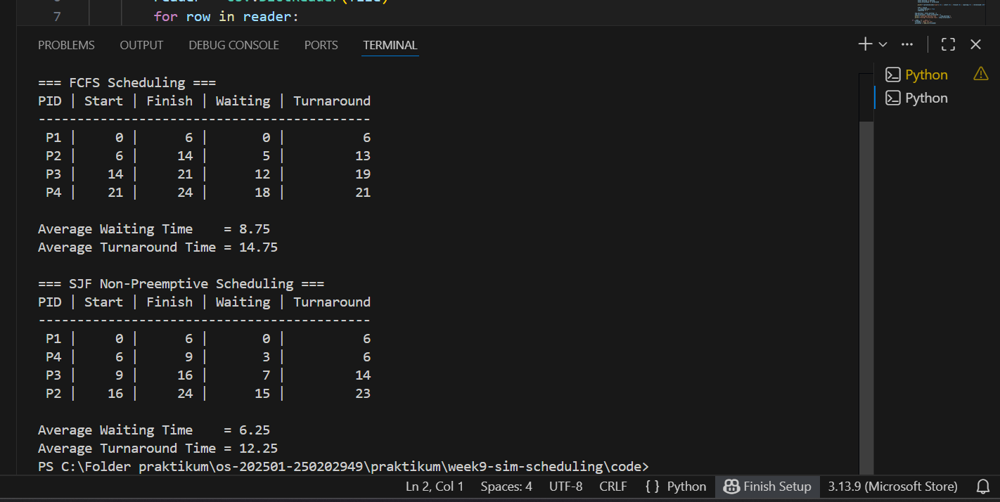

# Laporan Praktikum Minggu 9
Topik: Simulasi Algoritma Penjadwalan CPU  

---

## Identitas
- **Nama**  : M. Habibi Nur Ramadhan
- **NIM**   : 250202949
- **Kelas** : 1 IKRB

---

## Tujuan
Tujuan dari praktikum minggu ini.  

 Pada praktikum minggu ini, mahasiswa akan mengimplementasikan program simulasi sederhana algoritma penjadwalan CPU, khususnya FCFS dan SJF.
Berbeda dengan Minggu 5–6 yang berfokus pada perhitungan manual, pada minggu ini mahasiswa mulai mengotomatisasi perhitungan menggunakan program, menjalankan dataset uji, serta menyajikan hasil dalam bentuk tabel atau grafik.

Praktikum ini menjadi jembatan antara pemahaman konseptual dan implementasi komputasional algoritma sistem operasi.

Setelah menyelesaikan tugas ini, mahasiswa mampu:

1. Membuat program simulasi algoritma penjadwalan FCFS dan/atau SJF.
2. Menjalankan program dengan dataset uji yang diberikan atau dibuat sendiri.
3. Menyajikan output simulasi dalam bentuk tabel atau grafik.
4. Menjelaskan hasil simulasi secara tertulis.
5. Mengunggah kode dan laporan ke Git repository dengan rapi dan tepat waktu.


---

## Dasar Teori
1. Proses adalah program yang sedang dieksekusi oleh sistem operasi. Setiap proses membutuhkan sumber daya seperti CPU, memori, dan I/O untuk dapat berjalan. Karena CPU hanya dapat mengeksekusi satu proses pada satu waktu, maka diperlukan mekanisme untuk mengatur giliran eksekusi proses tersebut.
2. Scheduling proses adalah mekanisme sistem operasi untuk menentukan urutan eksekusi proses di CPU.
Parameter yang digunakan meliputi:
- **Arrival Time (AT)**
Waktu kedatangan proses ke dalam sistem.
- **Burst Time (BT)**
Lama waktu CPU yang dibutuhkan oleh proses untuk selesai dieksekusi.
- **Waiting Time (WT)**
Waktu yang dihabiskan proses menunggu di ready queue.
WT=Turnaround Time−Burst Time
- **Turnaround Time (TAT)**
Total waktu yang dibutuhkan proses sejak datang hingga selesai
TAT=Completion Time−Arrival Time
3. FCFS adalah algoritma penjadwalan non-preemptive yang mengeksekusi proses berdasarkan urutan kedatangan.

4. SJF adalah algoritma penjadwalan yang mengutamakan waktu eksekusi yang terkecil.

5. File CSV (Comma Separated Values) digunakan untuk menyimpan data proses seperti PID, arrival time, dan burst time. Penggunaan CSV mempermudah:
- Input data secara terstruktur
- Pemrosesan data menggunakan bahasa pemrograman seperti Python
- Pengujian berbagai algoritma scheduling dengan data yang sama

### Referensi

- Silberschatz, A., Galvin, P. B., & Gagne, G.
Operating System Concepts.
John Wiley & Sons, 9th Edition, 2018.
(Referensi utama untuk konsep process, CPU scheduling, FCFS, dan Round Robin)
- Tanenbaum, A. S., & Bos, H.
Modern Operating Systems.
Pearson Education, 4th Edition, 2015.
(Membahas detail algoritma penjadwalan dan time-sharing system)
- Stallings, W.
Operating Systems: Internals and Design Principles.
Pearson Education, 8th Edition, 2018.
- Arpaci-Dusseau, R. H., & Arpaci-Dusseau, A. C.
Operating Systems: Three Easy Pieces.
Arpaci-Dusseau Books, 2018.
- Silvia, L., & Putra, R.
Modul Praktikum Sistem Operasi.
Fakultas Ilmu Komputer, Universitas Indonesia, 2020.

---

## Langkah Praktikum dan Ketentuan Teknis
Bahasa pemrograman bebas (Python / C / Java / lainnya).
Tidak wajib GUI, cukup program berbasis terminal.

Fokus penilaian pada logika algoritma dan keakuratan hasil, bukan kompleksitas bahasa.

Struktur folder (sesuaikan dengan template repo):
```
praktikum/week9-sim-scheduling/
├─ code/
│  ├─ scheduling_simulation.*
│  └─ dataset.csv
├─ screenshots/
│  └─ hasil_simulasi.png
└─ laporan.md
```
### Langkah pengerjaan
1. **Menyiapkan Dataset**

   Buat dataset proses minimal berisi:

   | Proses | Arrival Time | Burst Time |
   |:--:|:--:|:--:|
   | P1 | 0 | 6 |
   | P2 | 1 | 8 |
   | P3 | 2 | 7 |
   | P4 | 3 | 3 |

2. **Implementasi Algoritma**

   Program harus:
   - Menghitung *waiting time* dan *turnaround time*.  
   - Mendukung minimal **1 algoritma (FCFS atau SJF non-preemptive)**.  
   - Menampilkan hasil dalam tabel.

3. **Eksekusi & Validasi**

   - Jalankan program menggunakan dataset uji.  
   - Pastikan hasil sesuai dengan perhitungan manual minggu sebelumnya.  
   - Simpan hasil eksekusi (screenshot).

4. **Analisis**

   - Jelaskan alur program.  
   - Bandingkan hasil simulasi dengan perhitungan manual.  
   - Jelaskan kelebihan dan keterbatasan simulasi.

5. **Commit & Push**

   ```bash
   git add .
   git commit -m "Minggu 9 - Simulasi Scheduling CPU"
   git push origin main
   ```

---

## Kode / Perintah
Tuliskan potongan kode atau perintah utama:

```
import csv

def read_csv(filename):
    processes = []
    with open(filename, 'r') as file:
        reader = csv.DictReader(file)
        for row in reader:
            processes.append({
                'pid': row['pid'],
                'arrival': int(row['arrival_time']),
                'burst': int(row['burst_time'])
            })
    return processes

def fcfs(processes):
    time = 0
    total_waiting = 0
    total_turnaround = 0

    processes.sort(key=lambda x: x['arrival'])  # Urutkan berdasarkan arrival time

    print("=== FCFS Scheduling ===")
    print("PID | Start | Finish | Waiting | Turnaround")
    print("-------------------------------------------")

    for p in processes:
        if time < p['arrival']:
            time = p['arrival']

        start = time
        finish = time + p['burst']
        waiting = start - p['arrival']
        turnaround = finish - p['arrival']

        total_waiting += waiting
        total_turnaround += turnaround

        print(f"{p['pid']:>3} | {start:>5} | {finish:>6} | {waiting:>7} | {turnaround:>10}")

        time = finish

    avg_waiting = total_waiting / len(processes)
    avg_turnaround = total_turnaround / len(processes)
    print(f"\nAverage Waiting Time    = {avg_waiting}")
    print(f"Average Turnaround Time = {avg_turnaround}")


def sjf(processes):
    time = 0
    completed = 0
    n = len(processes)
    total_waiting = 0
    total_turnaround = 0
    is_completed = [False]*n

    print("\n=== SJF Non-Preemptive Scheduling ===")
    print("PID | Start | Finish | Waiting | Turnaround")
    print("-------------------------------------------")

    while completed < n:
        idx = -1
        min_burst = float('inf')
        for i in range(n):
            if processes[i]['arrival'] <= time and not is_completed[i]:
                if processes[i]['burst'] < min_burst:
                    min_burst = processes[i]['burst']
                    idx = i
                elif processes[i]['burst'] == min_burst:
                    if processes[i]['arrival'] < processes[idx]['arrival']:
                        idx = i

        if idx == -1:
            time +=1
            continue

        start = time
        finish = time + processes[idx]['burst']
        waiting = start - processes[idx]['arrival']
        turnaround = finish - processes[idx]['arrival']

        total_waiting += waiting
        total_turnaround += turnaround

        print(f"{processes[idx]['pid']:>3} | {start:>5} | {finish:>6} | {waiting:>7} | {turnaround:>10}")

        time = finish
        is_completed[idx] = True
        completed += 1

    avg_waiting = total_waiting / n
    avg_turnaround = total_turnaround / n
    print(f"\nAverage Waiting Time    = {avg_waiting}")
    print(f"Average Turnaround Time = {avg_turnaround}")

if __name__ == "__main__":
    filename = "Data set.csv"
    processes = read_csv(filename)

    # FCFS
    fcfs(processes.copy())

    # SJF Non-Preemptive
    sjf(processes.copy())

```

---

## Hasil Eksekusi
Sertakan screenshot hasil percobaan atau diagram:


---

## Analisis
### 1. Jelaskan alur program.  
Alur kerja program simulasi penjadwalan proses menggunakan Python dan file CSV adalah sebagai berikut:

- **Membaca File CSV**
Program membaca data proses dari file CSV yang berisi Process ID (PID), Arrival Time, dan Burst Time. Data ini kemudian disimpan ke dalam struktur data berupa list of dictionary.

- **Inisialisasi Data Proses**
Setiap proses memiliki atribut arrival time, dan burst time.

- **Pemilihan Algoritma Scheduling**
Program menjalankan dua algoritma penjadwalan, antaralain:
First Come First Serve (FCFS) dan Shortest Job First (SJF).
Simulasi Eksekusi CPU
Pada FCFS, proses dieksekusi berdasarkan urutan kedatangan tanpa preemption.
Pada SJF, proses dieksekusi berdasarkan waktu eksekusi terkecil.

- **Perhitungan Waktu**
Program menghitung:
Start Time
Finish Time
Waiting Time
Turnaround Time
untuk setiap proses.

- **Perhitungan Nilai Rata-rata**
Setelah semua proses selesai, program menghitung rata-rata Waiting Time dan Turnaround Time.

- **Menampilkan Output**
Hasil simulasi ditampilkan dalam bentuk tabel dan nilai rata-rata.

### 2. Bandingkan hasil simulasi dengan perhitungan manual. 
1. FCFS (First Come First Serve)
Perhitungan Manual:

| Proses | Start | Finish | Waiting | Turnaround |
| ------ | ----- | ------ | ------- | ---------- |
| P1     | 0     | 6      | 0       | 6          |
| P2     | 6     | 14     | 5       | 13         |
| P3     | 14    | 21     | 12      | 19         |
| P4     | 21    | 24     | 18      | 21         |

Average Waiting Time = (0 + 5 + 12 + 18) / 4 = 8.75
Average Turnaround Time = (6 + 13 + 19 + 21) / 4 = 14.75

2. SJF Non-Preemptive (Shortest Job First)
Perhitungan Manual

| Proses | Start | Finish | Waiting | Turnaround |
| ------ | ----- | ------ | ------- | ---------- |
| P1     | 0     | 6      | 0       | 6          |
| P4     | 6     | 9      | 3       | 6          |
| P3     | 9     | 16     | 7       | 14         |
| P2     | 16    | 24     | 15      | 23         |

Average Waiting Time = (0 + 3 + 7 + 15) / 4 = 6.25

Average Turnaround Time = (6 + 6 + 14 + 23) / 4 = 12.25

**Kesimpulannya hasil perhitungan manual sama dengan hasil yang di tampilkan oleh program.**

### 3. Jelaskan kelebihan dan keterbatasan simulasi.

Kelebihan dari simulasi di antara lainnya yaitu proses perhitungan jauh lebih mudah dan otomatis, mudah untuk di modifikasi, dapat membandingkan algoritma, visualisasinya mudah karna output hasilnya berupa tabel dan sangat berguna sebagai media pembelajaran yang efektif.

sedangkan disatu sisinya memiliki kekurangan yaitu, tidak merepresentasikan sistem nyata secara lengkap, data proses bersifat statis, tidak mendukung semua algoritma, overhead logika tambahan tidak diperhitungkan, dan tidak mempertimbangkan faktor eksternal.


---

## Kesimpulan
- Simulasi program FCFS dan SJF dengan Python sangat berguna untuk pembelajaran dan analisis algoritma, karena cepat, otomatis, dan mudah dimodifikasi. Namun, simulasi tidak sepenuhnya mencerminkan kondisi sistem operasi nyata, sehingga hasilnya harus dipahami sebagai model teoretis.

- FCFS lebih mudah diimplementasikan, sedangkan SJF memberikan waktu tunggu rata-rata dan turnaround time yang lebih baik untuk sebagian kasus.

- Simulasi menggunakan Python dan CSV adalah media pembelajaran efektif untuk memahami konsep teori scheduling CPU.

---

## Quiz
1. Mengapa simulasi diperlukan untuk menguji algoritma scheduling?  
**Jawaban** : Simulasi diperlukan untuk menguji algoritma scheduling karena memberikan cara yang efisien dan akurat untuk mengevaluasi kinerja algoritma sebelum diterapkan pada sistem nyata. Tentunya sebelum di terapkan pada sistem nyata simulasi sangat diperlukan, ada beberapa alasannya:
- Akurasi dalam mengevaluasi kinerja
- Keamanan dan efisiensi biaya
- Sebagai pembanding berbagai skenario
- Mengidentifikasi masalah sejak dini/ melihat peluang kegagalan
- Dan sebagai alat bantu pembelajaran

2. Apa perbedaan hasil simulasi dengan perhitungan manual jika dataset besar? 
**Jawaban** : Jika menghitung manual pada data set yang besar, ini akan memakan waktu yang lama dan bisa saja terjadi kesalahan dalam perhitungan, sedangkan jika melakukan perhitungan dengan program / otomatis akan mengurangi potensi kesalahan dalam perhitungan dan tentunya proses perhitungan jadi lebih cepat.

3. Algoritma mana yang lebih mudah diimplementasikan? Jelaskan.
**Jawaban** : FCFS lebih mudah diimplementasikan alasan utamany karena, FCFS hanya perlu mengeksekusi proses sesuai urutan.

---

## Refleksi Diri
Tuliskan secara singkat:
- Apa bagian yang paling menantang minggu ini? Mengerjakan beberapa laporan dalam seminggu, dan mempelajari materi ini secara mandiri.
- Bagaimana cara Anda mengatasinya? Saya mulai membangun niat untuk mengerjakan dan mulai menyicil tugas perlahan-lahan.

---

**Credit:**  
_Template laporan praktikum Sistem Operasi (SO-202501) – Universitas Putra Bangsa_
